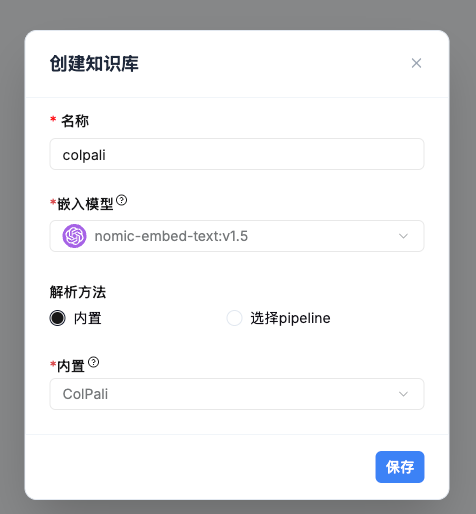
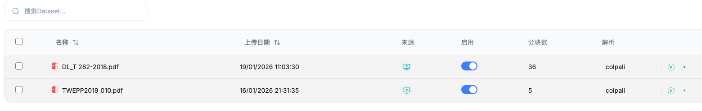

# ColPali 视觉检索

ColPali 是一种基于视觉理解的文档检索方法，特别适合处理包含图片、表格和 PPT 的文档。本文档将介绍如何在 KnowFlow 中使用 ColPali 功能。

## 什么是 ColPali

ColPali 是一种多模态检索技术，它将文档页面作为图像进行理解和检索，而不是传统的文本分块方式。这使得它在处理视觉密集型内容时表现出色。

### 适用场景

ColPali 特别适合以下场景：

✅ **推荐使用**：
- 单页图片检索（产品图、设计稿等）
- 表格密集型文档（财务报表、数据统计等）
- PPT 演示文稿（每页独立的幻灯片）
- 图文混排的单页内容

❌ **不推荐使用**：
- 答案跨页的长文档（如学术论文、技术手册）
- 纯文本文档（普通分块方法更高效）
- 需要跨页理解的内容

:::warning 重要限制
ColPali 使用视觉语言模型（VLM）进行检索，**不擅长处理答案跨页的场景**。如果您的文档内容需要跨页理解，建议使用其他解析方法（如 Smart、Title 等）。
:::

## 前置要求

在使用 ColPali 之前，请确保：

1. **已部署 ColPali API 服务**
   - ColPali 需要独立的 API 容器提供推理服务
   - 确认服务地址可访问（默认：`http://colpali-api:9100`）

2. **已部署 Milvus 向量数据库**
   - ColPali 使用 Milvus 进行向量存储和检索
   - 确认 Milvus 服务正常运行（默认：`http://milvus:19530`）

3. **已配置 VLM 视觉聊天模型**
   - 在"模型提供商"中配置支持视觉理解的模型
   - 推荐模型：Qwen-VL、GPT-4V 等


## 使用步骤

### 第一步：创建 ColPali 知识库

1. 进入"**知识库管理**"页面
2. 点击"**创建知识库**"
3. 在解析方法中选择 **ColPali**



:::tip 关键配置
一旦选择 ColPali 作为解析方法，该知识库的**所有文档**都将使用 ColPali 进行解析，其他解析方法将无法使用。
:::

### 第二步：上传文档

1. 进入刚创建的 ColPali 知识库
2. 点击"**上传文档**"
3. 选择要上传的文件

**支持的文档格式**：
- PDF 文档
- PowerPoint 演示文稿（.pptx）
- 图片文件（.jpg、.png 等）
- Word 文档（.docx）

**解析过程**：
- ColPali 会将每个文档页面转换为图像
- 使用视觉模型提取页面的多向量表示
- 存储到 Milvus 向量数据库中



### 第三步：配置聊天助理

创建或编辑聊天助理时，**必须选择 VLM 视觉聊天模型**：

1. 进入"**聊天助理**"页面
2. 创建新助理或编辑现有助理
3. 在"**模型配置**"中选择 **VLM 视觉聊天模型**
4. 关联 ColPali 知识库


:::danger 必须配置 VLM
ColPali 检索返回的是图像内容，**必须使用 VLM 视觉聊天模型**才能正确理解和回答。如果使用普通文本模型，将无法处理检索结果。
:::

### 第四步：开始问答

配置完成后，就可以开始使用了：

1. 进入对话界面
2. 输入您的问题
3. 系统会：
   - 使用 ColPali 检索相关页面
   - 将页面图像传递给 VLM 模型
   - VLM 基于图像内容生成回答


## 高级配置

### 调整检索参数

在聊天助理配置中，可以调整以下参数：

| 参数 | 说明 | 推荐值 |
|------|------|--------|
| **Top K** | 返回的相关页面数量 | 3-5 |
| **VLM Top N** | 传递给 VLM 的图像数量 | 3 |
| **相似度阈值** | 过滤低相关性结果 | 0.1-0.3 |

:::info VLM Top N
由于 VLM 处理多图像的成本较高，建议将 `vlm_top_n` 设置为 3-5，只传递最相关的页面图像。
:::

### 两阶段检索优化

ColPali 使用两阶段检索策略提升性能：

```
用户查询
    ↓
Stage 1: FDE 向量粗排（快速筛选候选）
    ↓
Stage 2: 多向量 MaxSim 精排（精确匹配）
    ↓
返回最相关的页面
```

**性能特点**：
- 检索延迟：~250ms（P50）
- 比传统 ES nested 方案快 **40-50 倍**

## 使用技巧

### 提问技巧

**有效的提问方式**：
- ✅ "这个产品的价格是多少？"（单页表格）
- ✅ "第三季度的销售数据如何？"（单页图表）
- ✅ "这张设计图的主要元素有哪些？"（单页图片）

**避免的提问方式**：
- ❌ "总结整个文档的内容"（跨页理解）
- ❌ "第一章和第三章的关系是什么？"（跨页关联）

### 文档准备建议

**优化文档质量**：
- 确保每页内容相对独立
- 避免重要信息跨页分布
- 图片和表格清晰可读
- PPT 每页主题明确

**文档组织**：
- 将相关内容整理在同一页
- 使用清晰的标题和标注
- 避免过于复杂的页面布局

## 常见问题

### Q1：为什么必须使用 VLM 模型？

**原因**：ColPali 检索返回的是文档页面的图像，而不是文本。只有 VLM（视觉语言模型）才能理解图像内容并生成回答。

**解决**：在聊天助理配置中选择支持视觉理解的模型，如 Qwen-VL、GPT-4V 等。

### Q2：ColPali 知识库可以混用其他解析方法吗？

**不可以**。一旦知识库选择了 ColPali 解析方法，该知识库的所有文档都将使用 ColPali 进行解析，无法切换到其他解析方法。

**建议**：如果需要使用不同的解析方法，请创建多个知识库。

### Q3：为什么跨页问题回答不准确？

**原因**：ColPali 基于单页图像进行检索和理解，VLM 模型不擅长跨页关联和推理。

**解决**：
- 对于需要跨页理解的文档，使用其他解析方法（如 Smart、Title）
- 重新组织文档，将相关内容整理在同一页

### Q4：检索速度慢怎么办？

**可能原因**：
- ColPali API 服务资源不足
- Milvus 数据库性能瓶颈
- VLM 模型推理速度慢

**优化建议**：
- 为 ColPali API 分配 GPU 资源
- 调整 Milvus HNSW 索引参数
- 减少 `vlm_top_n` 参数值
- 使用更快的 VLM 模型

### Q5：文档解析失败？

**检查项**：
- ColPali API 服务是否正常运行
- Milvus 数据库是否可访问
- 文档格式是否支持
- 文档是否损坏或加密

**解决**：
- 检查服务日志排查错误
- 尝试重新上传文档
- 联系系统管理员

## 性能对比

### 与传统方法对比

| 维度 | 传统文本分块 | ColPali 视觉检索 |
|------|-------------|-----------------|
| **适用场景** | 纯文本、长文档 | 图表、PPT、单页内容 |
| **跨页理解** | ✅ 支持 | ❌ 不支持 |
| **图表理解** | ❌ 较弱 | ✅ 优秀 |
| **检索速度** | 快 | 快（~250ms） |
| **模型要求** | 文本模型 | VLM 视觉模型 |
| **存储成本** | 低 | 中等 |

### 检索性能

| 指标 | 性能 |
|------|------|
| **P50 延迟** | ~250ms |
| **P99 延迟** | ~400ms |
| **Stage 1 粗排** | ~50-100ms |
| **Stage 2 精排** | ~100-200ms |

## 最佳实践

### 场景选择

**推荐使用 ColPali**：
- 产品目录（每页一个产品）
- 财务报表（表格密集）
- 设计稿集合（图片为主）
- 培训 PPT（每页独立主题）

**推荐使用其他方法**：
- 技术文档（需要跨章节理解）
- 学术论文（长篇连续内容）
- 法律合同（需要上下文关联）
- 小说书籍（连续叙事）

### 混合使用策略

对于复杂的知识管理场景，可以创建多个知识库：

```
企业知识库架构
├── 产品目录知识库（ColPali）
│   └── 产品图片、规格表
├── 财务报表知识库（ColPali）
│   └── 季度报表、数据图表
├── 技术文档知识库（Smart）
│   └── 开发手册、API 文档
└── 政策制度知识库（Title）
    └── 公司制度、流程文档
```

在聊天助理中可以同时关联多个知识库，系统会自动选择最合适的检索方法。

## 获取帮助

如需更多帮助，请：
- 访问 [GitHub Issues](https://github.com/knowflow-ai/KnowFlow)
- 联系技术支持团队

---

🎨 开始使用 ColPali 进行视觉检索吧！
