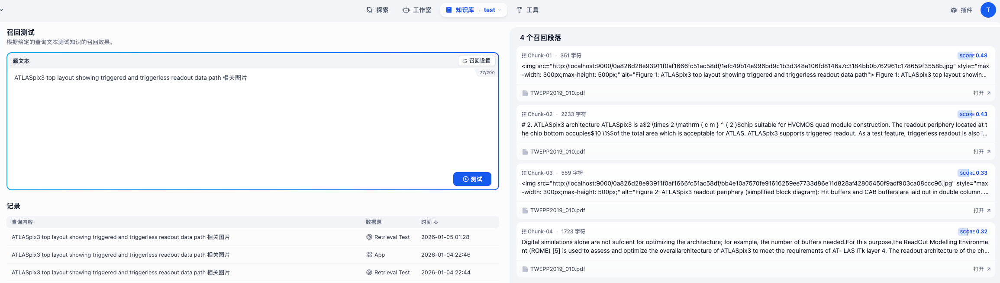
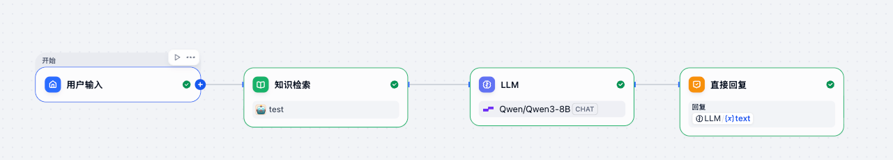
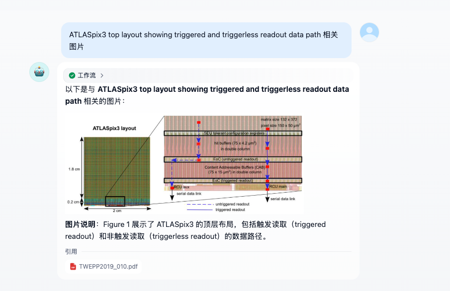
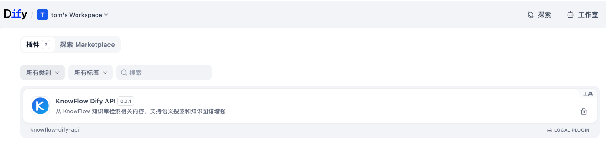
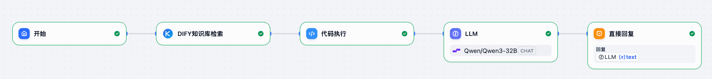
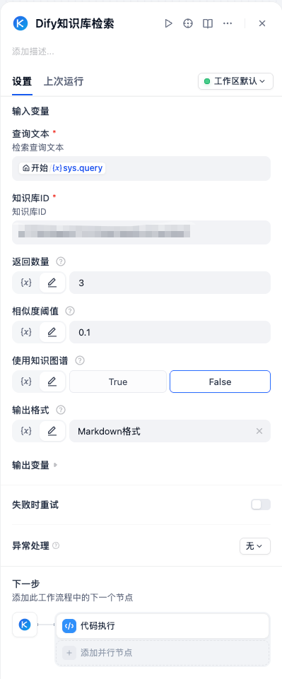
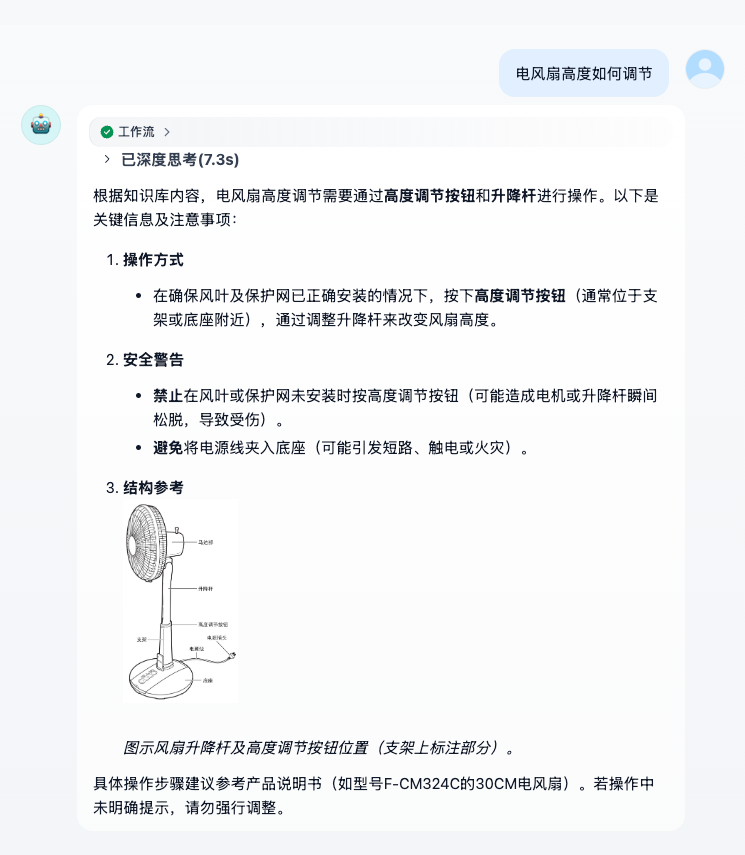

# Dify 接入

本文档介绍如何将 KnowFlow 知识库系统与 Dify 平台进行集成,实现知识库检索与 AI 对话的无缝对接。

## 概述

KnowFlow 支持两种方式与 Dify 平台集成:

| 接入方式 | 适用场景 | 特点 |
|---------|---------|------|
| **外部知识库接入** | 推荐方式,Dify 原生支持 | 配置简单,使用 Dify 内置知识检索节点,无需安装插件 |
| **插件接入** | 需要高级功能时使用 | 支持知识图谱增强、多种输出格式等高级特性 |

## 前置要求

- 已部署运行的 KnowFlow 实例
- Dify 平台账号
- KnowFlow API Key 和 Base URL

### (可选) 配置 MinIO 访问地址

如果 KnowFlow 中的文档包含图片,且使用 MinIO 作为对象存储,需要配置 MinIO 访问地址以确保图片链接可访问。

1. 编辑 KnowFlow 配置文件 `knowflow/docker/.env`

2. 配置 `MINIO_EXTERNAL_URL` 变量:
   ```bash
   MINIO_EXTERNAL_URL=http://192.168.1.100:9000
   ```

   **配置说明:**
   - 格式为: 内网 IP + 9000 端口
   - 确保该地址可以从 Dify 服务器访问
   - 例如: `http://192.168.1.100:9000`

3. 保存配置并重启 KnowFlow 服务:
   ```bash
   cd knowflow/docker
   docker compose restart
   ```

:::tip 重要提示
如果您在同一环境中同时部署了 Dify 和 RAGFlow,在启动 Dify 服务时需要添加 `-p dify` 参数,以避免容器冲突:
```bash
docker compose -f docker-compose.yaml -p dify up -d
```
:::

## 方式一: 外部知识库接入 (推荐)

Dify 原生支持外部知识库接入,通过配置 API 即可将 KnowFlow 作为外部知识库使用,无需安装插件。

### 步骤 1: 添加外部知识库 API

1. 登录 Dify 平台,进入**知识库**页面

2. 点击右上角 **外部知识库 API** → **添加外部知识库 API**

3. 填写外部知识库 API 配置:
   - **Name**: 自定义名称,例如 `test`
   - **API Endpoint**: KnowFlow Dify 接口地址,格式为:
     ```
     http://<knowflow-server>:9222/api/v1/dify
     ```
     例如: `http://host.docker.internal:9222/api/v1/dify`
   - **API Key**: 从 KnowFlow 系统获取的 API 密钥

4. 点击 **保存** 完成 API 配置


:::info 说明
- 如果 Dify 和 KnowFlow 部署在同一台服务器上,可使用 `host.docker.internal` 作为主机名
- 默认端口为 `9222`,请确保该端口可访问
:::

### 步骤 2: 链接外部知识库

1. 在 Dify **知识库**页面,点击 **创建知识库**

2. 选择 **连接外部知识库**

3. 选择刚才创建的外部知识库 API (如 `test`)

4. 填写 **外部知识库 ID**:
   - 在 KnowFlow 中找到目标知识库
   - 复制知识库 ID 填入

5. 点击 **创建**,完成知识库链接

6. (可选) 点击 **召回测试** 验证配置是否正确:
   - 输入测试查询文本
   - 检查是否能正确召回相关段落



### 步骤 3: 工作流编排引用外部知识库

1. 进入 **工作室**,创建或编辑一个 **Chatflow/Workflow** 应用

2. 在工作流中添加 **知识检索** 节点

3. 配置知识检索节点:
   - 选择刚才链接的外部知识库
   - 设置查询变量为用户输入

4. 添加 **LLM** 节点,配置:
   - 选择合适的模型 (如 Qwen/Qwen3-8B)
   - 在上下文中引用知识检索节点的结果
   - 设置系统提示词,确保基于知识库内容回答

5. 添加 **直接回复** 节点,输出 LLM 的回答

完整工作流示例:

```
用户输入 → 知识检索 → LLM → 直接回复
```



### 步骤 4: 问答测试

1. 点击右上角 **预览** 或 **运行**

2. 输入测试问题,验证知识库问答效果

3. 检查回答是否准确引用了知识库内容



---

## 方式二: 插件接入

通过 KnowFlow-Dify-API 插件,您可以在 Dify 工作流中直接调用 KnowFlow 知识库的检索能力,支持以下高级特性:

- 知识库检索 (支持知识图谱增强)
- 相似度阈值过滤
- 多种输出格式 (Markdown/JSON/Text)
- 图片链接原样保留

### 步骤 1: 下载并安装插件

1. 从 KnowFlow 项目获取插件文件:
   - 插件文件位置: `/docker/dify/knowflow-dify-api-v0.0.1.signed.difypkg`

2. 登录 Dify 平台,进入**工作室**页面

3. 点击左侧菜单 **插件** → **安装插件**

4. 选择 **上传插件包**,上传 `knowflow-dify-api-v0.0.1.signed.difypkg` 文件

5. 等待插件安装完成,插件名称为 **RAGFlow API**

6. 在插件列表中找到 **RAGFlow API** 插件,点击 **配置**

7. 填写插件配置:
   - **API Key**: 从 KnowFlow 系统获取的 API 密钥
   - **Base URL**: KnowFlow 服务地址,例如: `http://your-knowflow-server:9380`

8. 点击 **保存** 完成插件配置



### 步骤 2: 导入 DSL 工作流模板

1. 下载 DSL 配置文件:
   - DSL 文件位置: `/docker/dify/knowflow.yml`

2. 在 Dify 工作室中,点击 **创建应用** → **从 DSL 文件导入**

3. 选择 `knowflow.yml` 文件上传

4. 导入后,系统会自动创建包含以下节点的工作流:
   - **开始节点**: 接收用户输入和知识库 ID
   - **Dify知识库检索**: 调用 KnowFlow 检索 API
   - **代码执行**: 处理检索结果,提取格式化输出
   - **LLM**: 基于检索结果生成回答
   - **直接回复**: 返回最终答案

    

5. 配置关键参数:

   **知识库检索节点参数:**
   - `knowledge_id`: 知识库 ID (从 KnowFlow 获取)
   - `query`: 检索查询文本 (关联用户输入 `{{#sys.query#}}`)
   - `top_k`: 返回结果数量 (默认: 3)
   - `similarity_threshold`: 相似度阈值 (默认: 0.1,范围 0.0-1.0)
   - `use_knowledge_graph`: 是否启用知识图谱增强 (默认: 0)
   - `format_output`: 输出格式 (默认: markdown)

   **LLM 节点配置:**
   - 选择合适的 LLM 模型 (如 Qwen/Qwen3-32B)
   - 系统提示词已预设,确保严格按照知识库内容回答

    

### 步骤 3: 调试预览

1. 在 Dify 工作流编辑器中,点击右上角 **运行**

2. 在调试窗口中:
   - 输入 **知识库 ID** (conversation variable)
   - 输入测试问题

3. 点击 **发送**,观察执行流程:
   - 检查 **Dify知识库检索** 节点是否成功返回结果
   - 查看 **代码执行** 节点提取的格式化输出
   - 验证 **LLM** 节点生成的回答是否准确

4. 常见调试问题:
   - **401 Unauthorized**: 检查 API Key 是否正确配置
   - **知识库未找到**: 确认 knowledge_id 是否存在
   - **网络超时**: 检查 Base URL 是否可访问
   - **图片无法显示**: 检查 MinIO Public URL 配置

5. 调试通过后,点击 **发布** 上线应用



## 工作流说明

### 代码执行节点

该节点用于处理 KnowFlow API 返回的结果,提取 `formatted_output` 字段:

```python
def main(arg1):
    """
    arg1: Dify 传入的 ArrayObject,包含检索结果
    """
    formatted_output = "未找到 formatted_output"

    if isinstance(arg1, list) and len(arg1) > 0:
        data = arg1[0]
        formatted_output = data.get("formatted_output", formatted_output)

    return {
        "result": formatted_output
    }
```

### LLM 提示词

系统提示词确保 LLM 严格按照知识库内容回答:

```
你是一个严格按照知识库回答问题的智能助手。你需要根据知识库内容进找出相关的内容行回复。

回答规则:
1. 知识库可能有多个相关内容,你需要找出与用户问题最相关的内容。
2. 若知识库中找不到与问题直接相关的内容,回答必须包含:知识库中未找到您要的答案!
3. 禁止加入任何自己的解释、推测、总结性语言或通用知识
4. 如文中含有图片链接,需原样保留其位置与上下文,禁止任何形式的改写、移动或删除。

知识库内容:
{{#1761629388510.result#}}
```

## 高级配置

### 启用知识图谱增强

在 **Dify知识库检索** 节点中,将 `use_knowledge_graph` 设置为 `1`,可以利用知识图谱关系增强检索效果:

```yaml
use_knowledge_graph:
  type: constant
  value: 1
```

### 自定义相似度阈值

根据业务需求调整 `similarity_threshold` 参数:
- 较低值 (0.1-0.3): 返回更多相关结果,召回率高
- 较高值 (0.5-0.8): 返回更精确结果,准确率高

### 多知识库场景

如需在同一个应用中使用多个知识库,可以:
1. 添加 conversation variable 来动态切换 `knowledge_id`
2. 或使用多个检索节点并行检索不同知识库

## 常见问题

### 1. 插件安装失败

**原因**: 插件版本不兼容或文件损坏

**解决**:
- 确保下载完整的 `.difypkg` 文件
- 检查 Dify 版本是否支持插件功能
- 联系管理员获取最新版本插件

### 2. API 调用返回 401

**原因**: API Key 未配置或已过期

**解决**:
- 在 KnowFlow 中重新生成 API Key
- 在 Dify 插件配置中更新 API Key

### 3. 检索结果为空

**原因**: knowledge_id 错误或知识库未准备就绪

**解决**:
- 确认知识库 ID 是否正确
- 检查知识库是否已完成文档解析
- 尝试降低 `similarity_threshold` 值

### 4. 图片链接失效

**原因**: MinIO 访问地址配置错误

**解决**:
- 检查 MinIO Public URL 是否可从外网访问
- 确认存储桶权限设置为公开读取
- 测试图片 URL 是否可直接访问

## 获取帮助

如需更多帮助,请:
- 查看 [KnowFlow 官方文档](/)
- 访问 [GitHub Issues](https://github.com/weizxfree/KnowFlow/issues)
- 联系技术支持团队
