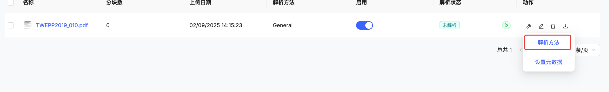
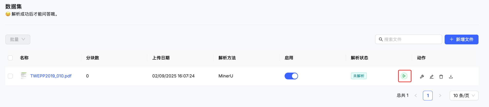

# 🧩 父子分块策略

父子分块是 KnowFlow 的智能分块功能，它将文档同时处理成两个层次的分块，让搜索既精确又完整。当您使用这个功能时，可以在保持搜索精度的同时，获得更完整的上下文信息。

## 🎯 功能介绍

### 什么是父子分块？

父子分块将每个文档智能地分成两个层次：

**📄 父分块**
- 包含完整段落或章节的大块内容
- 保持上下文的完整性和连贯性
- 通常包含 800-1500 个字符

**🔍 子分块** 
- 从父分块中提取的精确片段
- 便于快速匹配和精确搜索
- 通常包含 200-400 个字符

### 🌟 核心优势

**智能搜索**
- 先用小块精确匹配您的问题
- 再返回大块的完整答案内容
- 避免答案不完整或断章取义

**更好的体验**
- 搜索结果更准确
- 答案上下文更完整
- 减少多次搜索的需要

**灵活应用**
- 适合各种文档类型
- 支持不同搜索场景
- 可根据需要调整参数

## 💡 工作原理

### 分块过程

文档上传后，系统会自动进行以下处理：

1. **📖 文档解析**：将 PDF、Word 等文档转换为文本
2. **📝 智能分块**：按照段落和逻辑结构分成父分块
3. **🔍 细化分割**：将每个父分块进一步分割成子分块
4. **💾 建立关联**：记录父子分块之间的对应关系
5. **🔎 创建索引**：为搜索功能建立索引

### 搜索原理

当您进行搜索时：

1. **精确匹配**：系统先在子分块中找到最相关的内容
2. **扩展上下文**：然后返回对应父分块的完整内容
3. **结果呈现**：为您提供既精确又完整的搜索结果

## 📋 使用步骤

### 第一步：选择父子分块模式

1. 登录 KnowFlow 系统
2. 进入知识库管理页面  
3. 点击文件的"**编辑**"图标
4. 选择"**文档解析方法**"

### 第二步：选择父子分块策略

在分块策略下拉菜单中选择"**父子分块**"：

### 第三步：配置分块参数

根据您的文档类型和搜索需求，配置合适的参数：

**主要参数说明：**

| 参数 | 推荐值 | 适用场景 |
|------|--------|----------|
| **父分块大小** | 1024 | 一般文档，平衡上下文和精度 |
| **子分块大小** | 256 | 精确搜索，快速匹配 |
| **检索模式** | 父分块模式 | 返回完整上下文信息 |

**不同场景的建议配置：**

- 📚 **一般文档**：父分块 1024，子分块 256
- 📖 **长篇报告**：父分块 1536，子分块 384  
- 🔧 **技术手册**：父分块 2048，子分块 512
- 💬 **问答内容**：父分块 800，子分块 200

### 第四步：选择检索模式

系统提供三种检索模式，您可以根据需要选择：

**🎯 父分块模式（推荐）**
- 返回完整的段落内容
- 适合需要完整答案的场景
- 上下文丰富，理解更容易

**🔍 子分块模式** 
- 返回精确的匹配片段
- 适合关键词查找
- 结果简洁，查找迅速

**⚖️ 混合模式**
- 同时显示精确匹配和完整上下文  
- 适合需要对比验证的场景
- 信息全面，便于判断

### 第五步：解析文档

配置完成后，就可以点击解析按钮进行解析：

**解析过程**

文档上传后，系统会自动：
- 📖 解析文档内容和结构
- 📝 按照您的配置进行分块
- 🔗 建立父子分块的关联关系
- 💾 保存到知识库中

**查看解析状态**

在文档列表中可以看到处理进度：
- 🟡 **解析中**：正在处理，请稍等
- 🟢 **已完成**：可以开始搜索使用
- 🔴 **解析失败**：请检查文档格式或重试

**比较不同模式的效果**

以搜索"什么是深度学习？"为例：

- 🎯 **父分块模式**：返回完整的深度学习介绍段落，上下文丰富
- 🔍 **子分块模式**：返回精确的定义片段，信息简洁
- ⚖️ **混合模式**：同时显示精确定义和完整介绍

## 📖 适用场景

### 🤖 智能问答系统

**适合场景**：企业知识问答、客服机器人

**推荐配置**：父分块 1024，子分块 256，使用父分块模式

**为什么选择父子分块？**
- 快速找到相关问题的精确位置
- 返回完整的答案内容，避免信息不完整
- 减少用户需要多次搜索的情况

### 📋 技术文档管理

**适合场景**：API 文档、产品手册、操作指南

**推荐配置**：父分块 2048，子分块 512，使用混合模式

**为什么选择父子分块？**
- 按章节保持文档结构完整
- 精确定位特定的技术细节
- 便于快速查找配置信息和代码示例

### ⚖️ 合规文件检索

**适合场景**：合同条款、法规政策、规章制度

**推荐配置**：父分块 1536，子分块 384，使用父分块模式  

**为什么选择父子分块？**
- 保持法条和条款的完整性
- 精确匹配特定的法律术语
- 避免断章取义造成的误解

### 📚 研究文献管理

**适合场景**：学术论文、研究报告、期刊文章

**推荐配置**：父分块 1200，子分块 300，使用混合模式

**为什么选择父子分块？**
- 保持研究逻辑的连贯性
- 精确引用关键观点和数据
- 支持多角度的信息对比分析

## 💡 使用建议

### 选择合适的配置

**文档类型导向**
- 结构化文档（如手册）：选择较大的父分块
- 对话式内容（如FAQ）：选择较小的父分块
- 混合内容：使用默认配置后根据效果调整

**搜索习惯导向**
- 喜欢完整答案：选择父分块模式
- 喜欢快速定位：选择子分块模式  
- 需要对比验证：选择混合模式

### 性能考量

**相比普通分块的影响**
- 解析时间：增加约 20-30%
- 存储空间：增加约 30-40%
- 搜索速度：略有降低，但结果质量更好

**建议**
- 重要的核心文档建议使用父子分块
- 临时或参考性文档可以使用普通分块
- 根据实际使用情况平衡性能和效果

---

通过父子分块策略，KnowFlow 为您提供了更智能、更精确的文档搜索体验。根据您的具体需求选择合适的配置，就能获得最佳的使用效果。