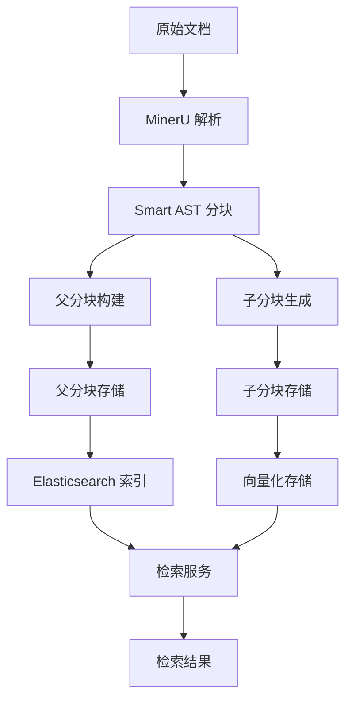
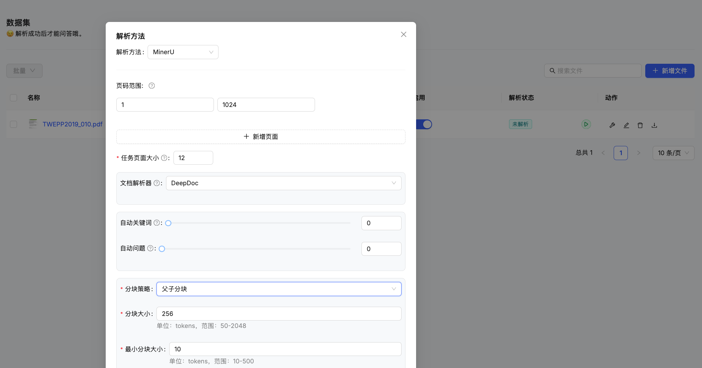
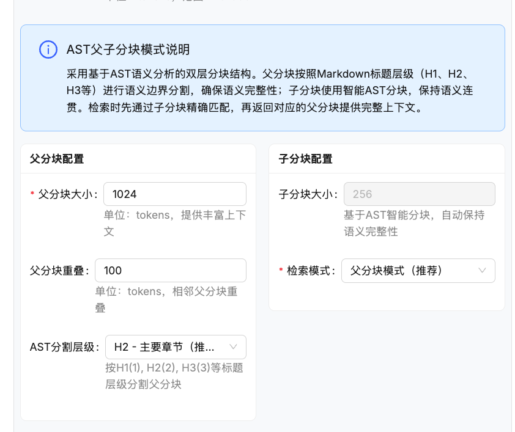

# 🧩 父子分块策略

KnowFlow 引入了创新的父子分块模式，基于现有的 Smart AST 分块技术，集成了 LangChain ParentDocumentRetriever，在文档解析时提供双层分段结构，显著提升检索准确性和上下文完整性。

## 🎯 概述

### 什么是父子分块？

父子分块是一种双层分块策略，将文档同时切分为：

- **父分块**: 较大的文本段落，包含丰富的上下文信息
- **子分块**: 较小的文本片段，便于精确检索和匹配

这种设计结合了**大文本段落的完整语义**和**小文本片段的检索精度**，是传统分块策略的重大改进。

### 核心优势

- ✅ **双重优势**: 兼顾检索精度和上下文完整性
- ✅ **智能检索**: 先用子分块精确匹配，再返回父分块完整内容
- ✅ **无缝集成**: 基于 Smart AST 分块，零侵入式升级
- ✅ **灵活配置**: 支持多种参数调整和检索模式
- ✅ **性能优化**: 采用索引和缓存提升检索效率

## 🏗️ 技术架构

### 分块流程



### 数据结构

#### 父分块 (Parent Chunk)
```python
{
    "id": "parent_chunk_001",
    "content": "完整的段落或章节内容，包含丰富上下文...",
    "document_id": "doc_123",
    "chunk_index": 1,
    "token_count": 1024,
    "child_chunks": ["child_001", "child_002", "child_003"],
    "metadata": {
        "title": "章节标题",
        "page_number": 5,
        "section": "2.1"
    }
}
```

#### 子分块 (Child Chunk)  
```python
{
    "id": "child_chunk_001", 
    "content": "精确的文本片段，便于检索匹配",
    "parent_id": "parent_chunk_001",
    "document_id": "doc_123",
    "chunk_index": 1,
    "token_count": 256,
    "vector_embedding": [0.1, 0.2, ...],
    "metadata": {
        "start_pos": 0,
        "end_pos": 256,
        "sentence_count": 3
    }
}
```

### 核心组件

| 组件 | 文件位置 | 功能 |
|------|----------|------|
| **分块器** | `/rag/nlp/parent_child_splitter.py` | 生成父子分块结构 |
| **检索器** | `/rag/nlp/ragflow_parent_retriever.py` | 实现智能检索逻辑 |
| **数据模型** | `/api/db/parent_child_models.py` | 定义数据库模型 |
| **MinerU集成** | `/knowflow/server/services/knowledgebases/mineru_parse/utils.py` | 文档解析集成 |

## 🚀 使用指南

### 环境准备

#### 1. 初始化数据库表

首次使用前需要创建父子分块相关的数据库表：

```bash
# 进入项目目录
cd KnowFlowPro

# 运行初始化脚本
uv run python3.10 api/db/init_parent_child_tables.py
```

执行成功后，会创建以下数据表：
- `parent_chunks` - 父分块数据表
- `child_chunks` - 子分块数据表  
- `chunk_relationships` - 父子关系映射表

#### 2. 确认服务运行

确保以下服务正常运行：
- Elasticsearch（用于全文检索）
- Redis（用于缓存）
- MySQL/PostgreSQL（用于数据存储）

### 前端配置

#### 1. 访问分块配置

1. 登录 KnowFlow 系统
2. 进入知识库管理页面
3. 点击"**创建知识库**"或"**编辑知识库**"
4. 在"**文档解析设置**"中找到分块策略选项



#### 2. 选择父子分块

在分块策略下拉菜单中选择"**父子分块**"：


#### 3. 基础参数配置

配置子分块的基本参数：

| 参数 | 建议值 | 说明 |
|------|--------|------|
| **子分块大小** | 256 tokens | 精确检索的文本片段大小 |
| **最小分块大小** | 50 tokens | 避免过小的无意义分块 |
| **重叠大小** | 50 tokens | 子分块间的重叠部分 |


#### 4. 父子分块参数

配置父子分块的高级参数：

| 参数 | 建议值 | 说明 |
|------|--------|------|
| **父分块大小** | 1024 tokens | 提供丰富上下文的大文本段落 |
| **父分块重叠** | 100 tokens | 相邻父分块的重叠部分 |
| **父分块分隔符** | `\n\n` | 按段落进行父分块分割 |
| **子分块分隔符** | `[。！？.!?]` | 按句子进行子分块分割 |
| **检索模式** | 父分块模式 | 检索返回的内容类型 |



:::tip 参数调优建议
- **长文档**: 父分块 1536, 子分块 384
- **短文档**: 父分块 512, 子分块 128  
- **技术文档**: 父分块 2048, 子分块 512
- **对话场景**: 父分块 800, 子分块 200
:::

### 检索模式

父子分块支持三种检索模式：

#### 1. 父分块模式（推荐）

**特点**: 返回包含完整上下文的父分块内容
**适用场景**: 问答系统、摘要生成、复杂推理

```python
# 检索配置
retrieval_config = {
    "mode": "parent",
    "max_results": 5,
    "min_score": 0.3
}
```

**返回示例**:
```json
{
    "chunks": [
        {
            "id": "parent_001",
            "content": "深度学习是机器学习的一个重要分支，它模仿人脑神经网络的结构和功能...",
            "score": 0.85,
            "type": "parent",
            "child_matches": ["child_001", "child_002"]
        }
    ]
}
```

#### 2. 子分块模式

**特点**: 返回精确匹配的子分块内容
**适用场景**: 关键词搜索、精确匹配、快速查找

```python
# 检索配置
retrieval_config = {
    "mode": "child", 
    "max_results": 10,
    "min_score": 0.4
}
```

**返回示例**:
```json
{
    "chunks": [
        {
            "id": "child_001",
            "content": "深度学习使用多层神经网络",
            "score": 0.92,
            "type": "child",
            "parent_id": "parent_001"
        }
    ]
}
```

#### 3. 混合模式

**特点**: 同时返回子分块和对应的父分块
**适用场景**: 需要同时查看精确匹配和完整上下文

```python
# 检索配置
retrieval_config = {
    "mode": "hybrid",
    "max_results": 5,
    "return_parent": True,
    "return_child": True
}
```

**返回示例**:
```json
{
    "chunks": [
        {
            "child": {
                "id": "child_001",
                "content": "深度学习使用多层神经网络",
                "score": 0.92
            },
            "parent": {
                "id": "parent_001", 
                "content": "深度学习是机器学习的一个重要分支...",
                "score": 0.85
            }
        }
    ]
}
```

### 文档解析流程

#### 1. 上传文档

1. 在知识库页面点击"**上传文档**"
2. 选择要解析的文件（支持 PDF、Word、PPT 等）
3. 确认分块策略已设置为"父子分块"
4. 点击"**开始上传**"


#### 2. 解析过程

系统将执行以下步骤：

1. **文档预处理**: MinerU 进行 OCR 和结构化解析
2. **Smart AST 分块**: 基于文档结构进行初步分块
3. **父分块构建**: 根据配置生成较大的父分块
4. **子分块生成**: 将父分块进一步细分为子分块
5. **关系建立**: 建立父子分块的映射关系
6. **索引存储**: 将分块数据存储到数据库和 Elasticsearch


#### 3. 解析状态

可以在文档列表中查看解析状态：

- 🟡 **解析中**: 父子分块正在生成
- 🟢 **已完成**: 父子分块生成完毕，可以进行检索
- 🔴 **解析失败**: 检查日志并重新解析


### 检索测试

#### 1. 测试检索效果

解析完成后，可以在知识库中测试检索效果：

1. 进入知识库详情页
2. 点击"**检索测试**"标签
3. 输入测试查询
4. 观察返回的父子分块结果


#### 2. 对比不同模式

可以切换不同的检索模式进行对比：

```bash
# 测试查询: "什么是深度学习？"

# 父分块模式结果
返回：完整的深度学习介绍段落（1024 tokens）
优点：上下文丰富，便于理解
缺点：可能包含冗余信息

# 子分块模式结果  
返回：精确的深度学习定义（256 tokens）
优点：信息精确，重点突出
缺点：上下文可能不完整

# 混合模式结果
返回：精确定义 + 完整段落
优点：兼顾精确性和完整性
缺点：返回内容较多
```

## 🔧 高级配置

### 自定义分割策略

#### 父分块分割符

支持多种父分块分割方式：

```python
# 按段落分割（默认）
parent_separators = ["\n\n", "\n\n\n"]

# 按章节分割
parent_separators = ["# ", "## ", "### "]

# 按页面分割  
parent_separators = ["\f", "---PAGE---"]

# 混合分割
parent_separators = ["\n\n", "# ", "## "]
```

#### 子分块分割符

支持多种子分块分割方式：

```python
# 按句子分割（中文）
child_separators = ["。", "！", "？", "；"]

# 按句子分割（英文）
child_separators = [".", "!", "?", ";"]

# 按子句分割
child_separators = ["，", ",", "、"]

# 混合分割
child_separators = ["。", "！", "？", ".", "!", "?"]
```

### 检索优化

#### 相似度阈值调整

```python
# 子分块匹配阈值
child_similarity_threshold = 0.3

# 父分块返回阈值
parent_similarity_threshold = 0.2

# 动态阈值（根据查询复杂度调整）
dynamic_threshold = True
```

#### 结果排序策略

```python
# 按子分块相似度排序
sort_by = "child_score"

# 按父分块相似度排序
sort_by = "parent_score"

# 按综合得分排序（推荐）
sort_by = "combined_score"
```

### 性能调优

#### 索引优化

```sql
-- 父分块索引
CREATE INDEX idx_parent_chunks_doc_id ON parent_chunks(document_id);
CREATE INDEX idx_parent_chunks_token_count ON parent_chunks(token_count);

-- 子分块索引
CREATE INDEX idx_child_chunks_parent_id ON child_chunks(parent_id);
CREATE INDEX idx_child_chunks_doc_id ON child_chunks(document_id);

-- 关系表索引
CREATE INDEX idx_relationships_parent_id ON chunk_relationships(parent_id);
CREATE INDEX idx_relationships_child_id ON chunk_relationships(child_id);
```

#### 缓存策略

```python
# 分块结果缓存
chunk_cache_ttl = 3600  # 1小时

# 检索结果缓存
retrieval_cache_ttl = 1800  # 30分钟

# 向量化缓存
embedding_cache_ttl = 7200  # 2小时
```

## 📊 应用场景

### 1. 智能问答系统

**场景**: 企业内部知识问答机器人

**配置建议**:
```python
config = {
    "parent_chunk_size": 1024,
    "child_chunk_size": 256,
    "retrieval_mode": "parent",
    "max_results": 3,
    "parent_separators": ["\n\n"],
    "child_separators": ["。", "！", "？"]
}
```

**优势**: 
- 子分块精确匹配用户问题
- 父分块提供完整答案上下文
- 降低答案截断和信息丢失

### 2. 技术文档检索

**场景**: API 文档、技术手册搜索

**配置建议**:
```python
config = {
    "parent_chunk_size": 2048, 
    "child_chunk_size": 512,
    "retrieval_mode": "hybrid",
    "max_results": 5,
    "parent_separators": ["## ", "### "],
    "child_separators": ["。", ". ", "\n"]
}
```

**优势**:
- 按章节组织父分块
- 精确检索代码片段和配置
- 保持技术文档的逻辑结构

### 3. 法律文件分析

**场景**: 合同条款、法规条文检索

**配置建议**:
```python
config = {
    "parent_chunk_size": 1536,
    "child_chunk_size": 384, 
    "retrieval_mode": "parent",
    "max_results": 2,
    "parent_separators": ["第", "条", "款"],
    "child_separators": ["；", "，", "。"]
}
```

**优势**:
- 保持法条的完整性
- 精确匹配关键法律术语
- 避免断章取义的风险

### 4. 学术论文研究

**场景**: 学术文献检索和引用

**配置建议**:
```python
config = {
    "parent_chunk_size": 1200,
    "child_chunk_size": 300,
    "retrieval_mode": "hybrid", 
    "max_results": 8,
    "parent_separators": ["## ", "\n\n"],
    "child_separators": ["。", ". ", "；"]
}
```

**优势**:
- 保持研究逻辑的连贯性
- 精确引用关键观点
- 支持多角度信息整合

## 🔍 监控与调试

### 分块质量评估

#### 分块统计信息

```python
# 获取分块统计
chunk_stats = {
    "total_parents": 156,
    "total_children": 624, 
    "avg_parent_size": 1024,
    "avg_child_size": 256,
    "parent_child_ratio": 4.0,
    "coverage_rate": 0.95
}
```

#### 分块质量指标

| 指标 | 说明 | 理想值 |
|------|------|--------|
| **覆盖率** | 子分块覆盖父分块的比例 | > 90% |
| **重叠率** | 相邻分块的重叠比例 | 5-15% |
| **一致性** | 分块大小的标准差 | < 20% |
| **完整性** | 语义完整的分块比例 | > 80% |

### 检索性能监控

#### 检索响应时间

```python
# 性能指标
performance_metrics = {
    "avg_retrieval_time": 150,  # 毫秒
    "p95_retrieval_time": 300,  # 毫秒
    "cache_hit_rate": 0.75,     # 缓存命中率
    "index_efficiency": 0.92    # 索引效率
}
```

#### 检索质量评估

```python
# 质量指标
quality_metrics = {
    "precision": 0.85,      # 精确率
    "recall": 0.78,         # 召回率
    "f1_score": 0.81,       # F1 得分
    "user_satisfaction": 4.2 # 用户满意度（5分制）
}
```

### 日志和调试

#### 启用调试日志

```bash
# 设置日志级别
export LOG_LEVEL=DEBUG

# 启用分块调试
export PARENT_CHILD_DEBUG=true

# 查看分块日志
tail -f /var/log/knowflow/parent_child.log
```

#### 常见日志示例

```
[2024-01-15 10:30:00] INFO: 开始父子分块处理
[2024-01-15 10:30:01] DEBUG: 生成父分块 125 个，平均大小 1024 tokens
[2024-01-15 10:30:02] DEBUG: 生成子分块 500 个，平均大小 256 tokens  
[2024-01-15 10:30:03] INFO: 建立父子关系映射 500 条
[2024-01-15 10:30:04] INFO: 父子分块处理完成，耗时 4.2 秒
```

## ⚠️ 注意事项与最佳实践

### 性能影响

#### 存储开销

- **存储增加**: 比常规分块增加约 40% 存储空间
- **索引大小**: Elasticsearch 索引大小增加约 30%
- **内存使用**: 检索时内存使用增加约 20%

#### 处理时间

- **解析耗时**: 比常规分块增加约 25% 处理时间
- **检索延迟**: 增加约 30-50ms 检索延迟
- **首次建索引**: 需要额外 10-20 分钟建立父子关系索引

### 配置建议

#### 参数优化

```python
# 推荐配置（通用场景）
recommended_config = {
    "parent_chunk_size": 1024,
    "child_chunk_size": 256,
    "parent_overlap": 100,
    "child_overlap": 50,
    "max_parent_children": 6,
    "min_child_size": 50
}

# 高精度配置（关键业务）
high_precision_config = {
    "parent_chunk_size": 512,
    "child_chunk_size": 128,
    "parent_overlap": 50,
    "child_overlap": 25,
    "max_parent_children": 4,
    "min_child_size": 30
}
```

#### 使用限制

1. **文档大小**: 建议单个文档不超过 50MB
2. **分块数量**: 单个文档父分块不超过 1000 个
3. **并发处理**: 同时解析文档数不超过 10 个
4. **资源要求**: 建议 4GB 以上可用内存

### 常见问题解决

#### Q1: 父子分块解析失败

**现象**: 选择父子分块后，文档解析显示错误

**解决方案**:
```bash
# 1. 检查数据库表是否创建
mysql -u root -p -e "SHOW TABLES LIKE '%chunk%';"

# 2. 重新初始化表结构
uv run python3.10 api/db/init_parent_child_tables.py

# 3. 重启相关服务
docker-compose restart knowflow-api
```

#### Q2: 检索结果为空

**现象**: 使用父子分块后，搜索无法返回结果

**解决方案**:
```bash
# 1. 检查 Elasticsearch 索引
curl "http://localhost:9200/_cat/indices?v" | grep chunk

# 2. 重建索引
POST http://localhost:9200/parent_chunks/_refresh
POST http://localhost:9200/child_chunks/_refresh

# 3. 检查分块数据
mysql -u root -p -e "SELECT COUNT(*) FROM parent_chunks;"
```

#### Q3: 检索速度较慢

**现象**: 父子分块检索比常规分块慢很多

**解决方案**:
```python
# 1. 启用缓存
cache_config = {
    "enable_cache": True,
    "cache_ttl": 1800,
    "max_cache_size": 1000
}

# 2. 优化索引
CREATE INDEX idx_child_parent_mapping ON child_chunks(parent_id, document_id);

# 3. 调整检索参数
retrieval_config = {
    "max_results": 5,  # 减少返回数量
    "min_score": 0.4,  # 提高阈值
    "enable_parallel": True  # 启用并行检索
}
```

## 🔮 未来规划

### 即将推出的功能

1. **智能分块边界检测**: 基于 NLP 技术自动识别最佳分块位置
2. **动态分块大小**: 根据内容复杂度自动调整分块大小
3. **多级分块**: 支持三级或更多级的分块层次结构
4. **分块质量评分**: 自动评估分块质量并提供优化建议

### 性能优化计划

1. **GPU 加速**: 利用 GPU 加速向量化和相似度计算
2. **分布式处理**: 支持多节点并行分块处理
3. **增量更新**: 支持文档增量更新时的增量分块
4. **压缩存储**: 采用压缩算法减少存储开销

---

如需更多帮助或反馈问题，请参考 [API 文档](../API接口/api-overview) 或在 [GitHub Issues](https://github.com/weizxfree/KnowFlow/issues) 中提出。