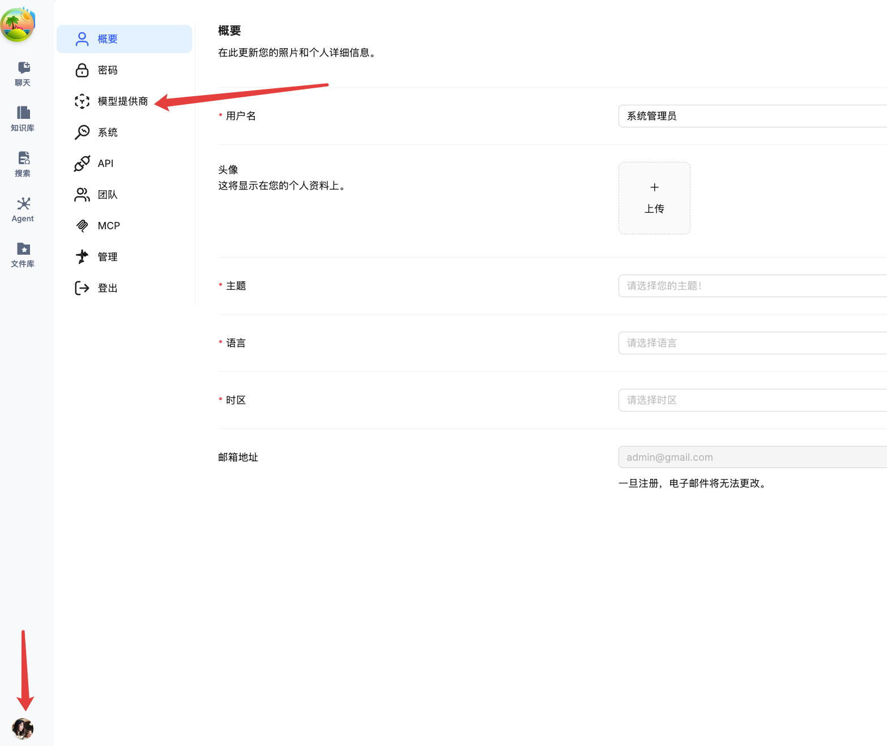
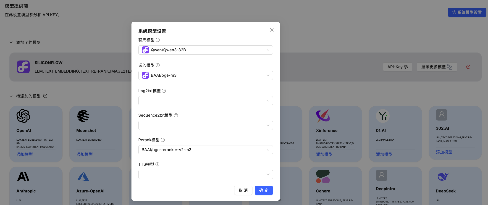
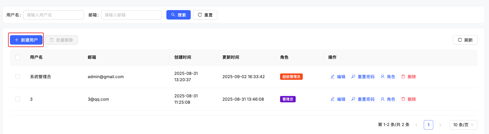
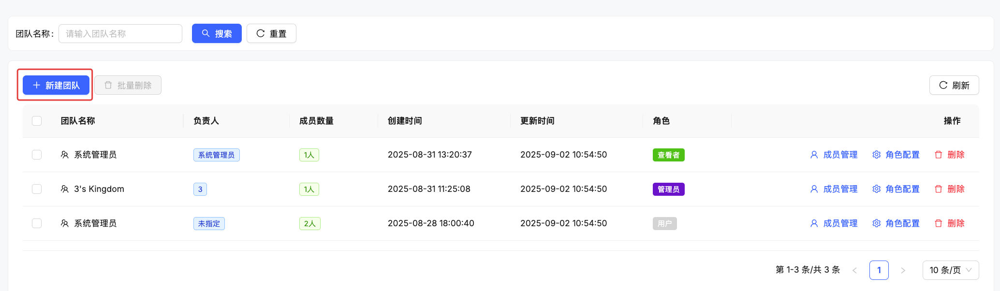
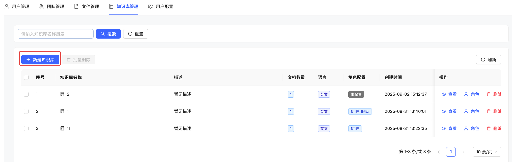
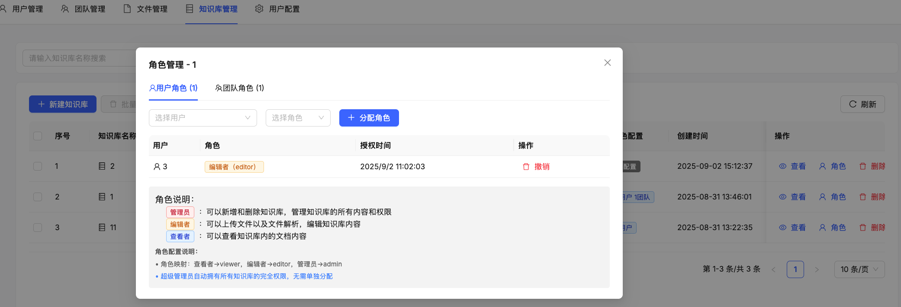
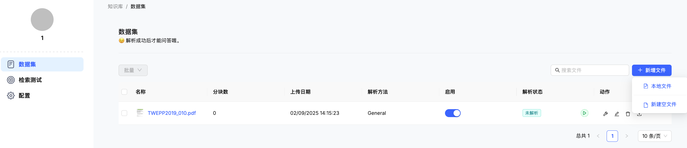
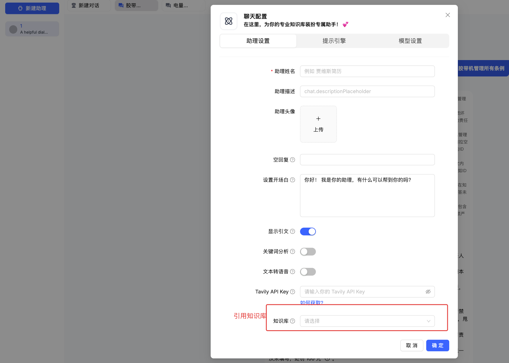

# 快速入门

欢迎使用 KnowFlow！本指南将帮助您快速上手，从登录系统到完成第一次智能问答的完整流程。

## 入门流程概览

KnowFlow 的使用分为以下几个步骤：

1. **登录系统** - 使用超级管理员账户登录
2. **配置模型** - 设置 AI 模型参数 
3. **创建组织** - 建立用户、团队和知识库
4. **上传文档** - 添加文档并进行解析
5. **开始问答** - 体验智能搜索和回答功能

让我们开始吧！

## 🔐 第一步：登录系统

### 访问 KnowFlow

打开浏览器，访问您的 KnowFlow 系统地址（通常是 `http://localhost`）

### 使用超级管理员登录

使用系统预设的超级管理员账户登录：

- **用户名**：admin@gmail.com
- **密码**：admin（首次登录后建议修改）

:::tip 安全提醒
首次登录后，请立即修改超级管理员密码以确保系统安全。
:::

## 第二步：配置 AI 模型

登录后，首先需要配置 AI 模型才能正常使用问答功能。

### 进入模型配置

1. 点击左下角用户头像
2. 选择"**模型提供商**"
3. 进入模型配置页面

### 配置大语言模型和嵌入模型

**选择模型类型**：
- OpenAI GPT 系列
- 国产大模型（如通义千问、文心一言等）
- 本地部署模型

**填写配置信息**：
- **API 地址**：模型服务的 API 端点
- **API 密钥**：您的模型服务密钥
- **模型名称**：具体使用的模型（如 gpt-3.5-turbo）

:::info 
推荐可以先用[硅基流动](https://siliconflow.cn/)申请 API 密钥进行测试
:::

## 第三步：创建组织架构

现在开始创建用户、团队和知识库。

### 创建用户

1. 进入"**用户管理**"页面
2. 点击"**新建用户**"
3. 填写用户信息：
   - 用户名
   - 邮箱
   - 初始密码
   - 分配全局角色

**推荐的用户角色分配**：
- **管理员**：部门负责人，可以创建知识库
- **编辑者**：内容管理人员
- **普通用户**：一般使用者

### 创建团队（可选）

如果需要团队协作，可以创建团队：

1. 进入"**团队管理**"页面  
2. 点击"**新建团队**"
3. 设置团队信息：
   - 团队名称
   - 团队描述
   - 添加团队成员

### 创建知识库

1. 进入"**知识库管理**"页面
2. 点击"**创建知识库**"
3. 填写知识库信息：
   - 知识库名称
   - 描述信息
   - 选择分块策略

### 知识库授权（可选）

如果需要为特定用户或团队授权：

1. 进入知识库详情页
2. 点击"**权限管理**"
3. 添加用户或团队权限：
   - **管理者**：可以管理知识库和分配权限
   - **编辑者**：可以上传和编辑文档
   - **查看者**：只能查看和搜索

## 📄 第四步：上传文档

现在可以向知识库添加文档了。

### 选择知识库

1. 进入目标知识库
2. 点击"**上传文档**"按钮

### 上传文档

**支持的文档格式**：
- PDF 文档
- Word 文档（.docx）
- PowerPoint 演示文稿（.pptx）
- 文本文件（.txt）
- Markdown 文件（.md）

**上传步骤**：
1. 拖拽文件或点击选择文件
2. 确认分块策略设置
3. 点击"**开始上传**"

### 等待解析完成

文档上传后会自动进行解析：

- 🟡 **解析中**：正在处理文档
- 🟢 **已完成**：可以开始使用
- 🔴 **解析失败**：需要重新上传

:::info 解析时间
解析时间取决于文档大小和复杂程度，通常几分钟内完成。
:::

## 💬 第五步：开始智能问答

文档解析完成后，就可以开始使用了！

### 进入对话界面

1. 创建聊天助理
2. 新建对话
3. 开始您的第一次提问

### 提问技巧

**有效的提问方式**：
- ✅ "请介绍一下深度学习的基本概念"
- ✅ "如何配置 API 接口？"
- ✅ "公司的请假流程是什么？"

**避免的提问方式**：
- ❌ "这个怎么办？"（过于模糊）
- ❌ "帮我写代码"（超出文档范围）

### 查看回答

系统会基于您上传的文档内容回答问题：

- 📝 **智能回答**：基于文档内容的准确回答
- 🔍 **相关引用**：显示答案来源的文档片段
- ⭐ **相关性评分**：显示内容的匹配程度

## 使用技巧

### 提升问答质量

**文档准备**：
- 上传结构清晰的文档
- 避免重复和无关内容
- 定期更新文档内容

**提问技巧**：
- 问题要具体明确
- 可以追问细节问题
- 利用文档中的关键词

### 团队协作

**权限管理**：
- 合理分配用户权限
- 定期审查权限设置
- 利用团队功能简化管理

**内容维护**：
- 指定专人负责内容更新
- 建立文档更新流程
- 定期清理过时内容

## ❓ 常见问题

### Q1：登录后看不到管理功能？
**解决**：确认您使用的是超级管理员账户，或者账户具有相应的管理权限。

### Q2：模型配置后无法使用？
**解决**：检查 API 密钥是否正确，网络连接是否正常，模型服务是否可用。

### Q3：文档解析失败？
**解决**：检查文档格式是否支持，文档是否损坏，文件大小是否超限。

### Q4：搜索结果不准确？
**解决**：检查文档质量，尝试调整分块策略，或重新上传更清晰的文档。

## 🎉 恭喜！

您已经完成了 KnowFlow 的基础配置！现在可以：

- ✅ 继续上传更多文档丰富知识库
- ✅ 邀请团队成员加入使用
- ✅ 探索更多高级功能
- ✅ 根据使用情况优化配置

如需了解更多功能，请查看其他章节的详细说明。

---

🚀 开始您的智能知识管理之旅吧！