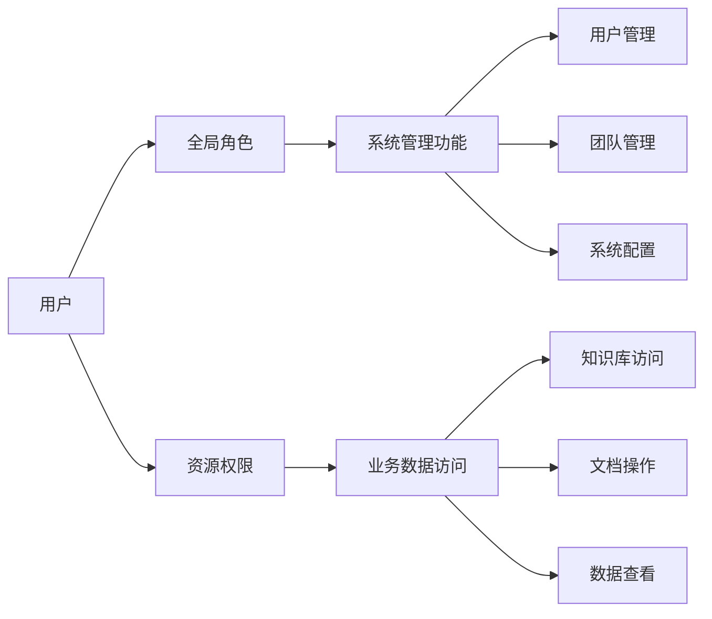

# 🔐 RBAC 权限管理

KnowFlow 采用分离式 RBAC（Role-Based Access Control）权限架构，实现了**全局角色与资源权限分离**的安全设计，提供企业级的精确权限控制。

## 🎯 核心概念

### 基本组件

- **用户（User）**: 系统中的个体用户
- **角色（Role）**: 权限的集合，分为全局角色和资源角色
- **权限（Permission）**: 对特定操作的授权
- **资源（Resource）**: 需要保护的业务对象（知识库、文档等）
- **团队（Team）**: 用户组织单位，支持团队级权限管理

### 分离式权限架构



**关键原则**: 全局角色与资源权限完全隔离，防止权限过度授权。

## 🏗️ 权限体系架构

### 权限检查优先级

基于源代码实现的实际检查顺序：

1. **超级管理员检查** - 最高优先级 🔴
   - 检查 `user.is_superuser = 1` 字段
   - 或具有 `super_admin` 角色
   - **拥有系统和资源的双重全权限**
   - 是分离式架构的**唯一例外**

2. **直接资源权限检查** 🟡
   - 查询 `rbac_resource_permissions` 表
   - 用户直接被授予的特定资源权限

3. **资源级角色权限检查** 🟢
   - **用户直接角色**: `ur.resource_id = 特定资源ID`
   - **团队角色**: 通过 `user_tenant` 关联获得的团队角色
   - 仅对特定资源有效

4. **资源所有者权限** 🔵
   - 资源创建者（如知识库的 `created_by`）自动拥有管理权限

### 🚨 超级管理员特权

```python
# 权限检查第一步（源代码）
if self._is_super_admin(user_id):
    return PermissionCheck(
        has_permission=True,        # 直接返回True
        resource_type=resource_type,  # 适用于任何资源
        resource_id=resource_id,      # 适用于任何资源ID
        reason="超级管理员权限"
    )
```

**超级管理员权限范围**:
- ✅ **系统管理**: 用户管理、团队管理、系统配置
- ✅ **资源访问**: 查看所有知识库、编辑所有文档、删除任何资源
- ✅ **菜单入口**: 前端通过 `userInfo.is_superuser` 控制管理菜单显示

### ⚠️ 重要：普通角色的分离机制

```python
# 普通角色的权限检查逻辑（源代码）
WHERE ur.user_id = %s 
AND ur.resource_id = %s  # 要求精确匹配，不包含 NULL
```

**分离式设计说明**: 
- 全局角色（`ur.resource_id IS NULL`）**不会**继承到具体资源
- 每个资源的访问权限都需要**显式授权**
- 这是为了安全考虑的**故意设计**

## 🔄 角色类型详解

### 1. 全局角色

**定义**: `resource_id = NULL` 的角色，仅用于系统功能管理

| 角色代码 | 角色名称 | 权限范围 | 典型用途 |
|---------|---------|---------|----------|
| `super_admin` | 超级管理员 | 系统全权限 | 系统维护、用户管理 |
| `admin` | 管理员 | 租户管理权限 | 团队管理、系统配置 |
| `editor` | 编辑者 | 系统编辑权限 | 内容管理、审核 |
| `viewer` | 查看者 | 系统查看权限 | 只读访问 |
| `user` | 普通用户 | 基础系统权限 | 一般用户 |

**作用范围**: 
- ✅ 用户管理、团队管理、系统配置
- ❌ 不能访问具体的知识库、文档内容

### 2. 资源级角色

**定义**: `resource_id = 具体资源ID` 的角色，用于业务数据访问

```python
# 示例：知识库编辑者角色
user_role = {
    "user_id": "user123",
    "role_code": "editor", 
    "resource_type": "knowledgebase",
    "resource_id": "kb_456",  # 特定知识库
    "tenant_id": "default"
}
```

**作用范围**: 
- ✅ 可以访问指定的知识库内容
- ❌ 不能管理用户或修改系统设置

## 📋 权限类型和资源

### 基础权限类型

| 权限类型 | 代码 | 描述 | 权限级别 |
|---------|------|------|---------|
| 读取权限 | `read` | 查看资源内容 | 基础 |
| 写入权限 | `write` | 编辑资源内容 | 中等 |
| 删除权限 | `delete` | 删除资源 | 高级 |
| 管理权限 | `admin` | 管理资源和权限 | 最高 |
| 分享权限 | `share` | 分享资源 | 中等 |
| 导出权限 | `export` | 导出资源数据 | 基础 |

### 资源类型

| 资源类型 | 代码 | 描述 | 示例操作 |
|---------|------|------|---------|
| 知识库 | `knowledgebase` | 文档集合 | 查看知识库、添加文档 |
| 文档 | `document` | 单个文档 | 编辑文档、删除文档 |
| 团队 | `team` | 用户组织 | 管理团队成员 |
| 系统 | `system` | 系统功能 | 系统配置、全局设置 |
| 用户 | `user` | 用户账户 | 用户信息管理 |

## 🔧 权限授权模式

### 1. 单一角色语义

**原则**: 同一作用域内用户只能有一个角色，新角色替换旧角色

```python
# 授权逻辑（源代码）
# 1. 删除同一作用域下的旧角色
DELETE FROM rbac_user_roles 
WHERE user_id = %s AND resource_id = %s

# 2. 插入新角色
INSERT INTO rbac_user_roles (user_id, role_id, resource_id, ...)
```

**优势**: 
- 避免权限冲突
- 简化权限管理
- 减少安全风险

### 2. 团队权限管理

**机制**: 团队可以被授予资源级角色，团队成员自动获得相应权限

```sql
-- 团队角色查询
SELECT r.code, r.name FROM rbac_team_roles tr
JOIN user_tenant ut ON tr.team_id = ut.tenant_id  
WHERE ut.user_id = %s AND tr.resource_id = %s
```

## 🛡️ 安全特性

### 权限隔离保护

1. **垂直隔离**: 普通全局角色不能直接访问业务数据（超级管理员除外）
2. **水平隔离**: 资源权限不会跨资源传播
3. **显式授权**: 每个权限都需要明确授予（超级管理员除外）

### 权限审计

- **操作日志**: 记录所有权限变更
- **权限来源**: 清晰标识权限获得方式
- **过期管理**: 支持权限有效期设置

## 📊 实际应用场景

### 场景1: 超级管理员

```python
# 超级管理员标识
user_info = {
    "is_superuser": True,  # 关键标识
    "id": "admin_user"
}

# 权限范围（无限制）
permissions = [
    "✅ 用户管理、团队管理、系统配置",
    "✅ 查看所有知识库内容",
    "✅ 编辑所有文档",
    "✅ 删除任何资源",
    "✅ 管理菜单入口可见",      # userInfo.is_superuser 控制
    "✅ 绕过所有权限检查"       # 权限检查第一优先级
]
```

**前端菜单控制逻辑**:
```typescript
// web/src/pages/user-setting1/sidebar/index.tsx (第70-72行)
if (x === UserSettingRouteKey.Management) {
  return userInfo?.is_superuser;  // 仅超级管理员可见管理菜单
}
```

### 场景2: 普通系统管理员

```python
# 全局admin角色
user_roles = {
    "role_code": "admin",
    "resource_id": None,  # 全局角色
    "resource_type": None,
    "is_superuser": False  # 非超级管理员
}

# 权限范围（受分离式架构限制）
permissions = [
    "✅ 用户管理",
    "✅ 团队管理", 
    "✅ 系统配置",
    "❌ 不能访问知识库内容",  # 需要额外的资源级授权
    "❌ 不能查看文档内容",
    "❌ 管理菜单不可见"      # is_superuser = False
]
```

### 场景3: 知识库协作者

```python
# 资源级editor角色
user_roles = {
    "role_code": "editor",
    "resource_id": "kb_123",  # 特定知识库
    "resource_type": "knowledgebase"
}

# 权限范围  
permissions = [
    "✅ 查看kb_123的内容",
    "✅ 编辑kb_123的文档",
    "✅ 添加新文档到kb_123",
    "❌ 不能管理其他用户",     # 无全局管理权限
    "❌ 不能访问其他知识库"    # 资源隔离
]
```

### 场景4: 团队项目组

```python
# 团队角色授权
team_role = {
    "team_id": "team_project_a",
    "role_code": "editor", 
    "resource_id": "kb_project_a",
    "resource_type": "knowledgebase"
}

# 团队成员自动获得权限
members = ["user1", "user2", "user3"]  # 都可以编辑项目知识库
```

## 🔄 权限管理最佳实践

### 1. 角色分配策略

**全局角色分配**:
- 仅给需要系统管理的用户分配全局角色
- 定期审查全局管理员列表
- 遵循最小权限原则

**资源角色分配**:
- 根据业务需要精确分配资源权限
- 使用团队角色简化批量授权
- 定期清理不活跃的资源权限

### 2. 安全监控

- 监控全局角色的使用情况
- 审计资源权限的授权模式
- 定期检查权限有效期和活跃状态

### 3. 用户体验优化

- 为用户提供清晰的权限说明界面
- 区分显示系统管理权限和业务数据权限
- 提供权限申请和审批流程

## ⚡ 性能优化

### 权限缓存机制

系统实现了多层权限缓存：

```python
# 缓存键结构
cache_key = f"perm:{user_id}:{resource_type}:{resource_id}:{permission_type}"

# 缓存层级
- L1: 内存缓存 (快速访问)
- L2: Redis缓存 (分布式)  
- L3: 数据库查询 (最终数据源)
```

### 批量权限检查

支持批量权限验证，减少数据库查询：

```python
# 批量检查示例
permissions = permission_service.check_batch_permissions(
    user_id="user123",
    checks=[
        ("knowledgebase", "kb_1", "read"),
        ("knowledgebase", "kb_2", "write"),
        ("document", "doc_1", "delete")
    ]
)
```

---

这种分离式权限架构确保了 KnowFlow 的安全性和可管理性，为企业级应用提供了强大而灵活的权限控制能力。通过明确区分全局管理权限和业务数据权限，系统能够有效防止权限滥用，同时支持复杂的企业协作场景。