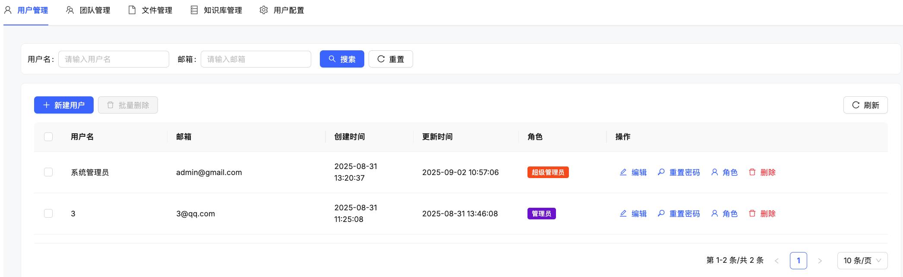

# 🔐 RBAC 权限管理

KnowFlow 提供了完善的权限管理功能，帮助企业实现精确的权限控制。通过**全局角色**和**资源权限**两个层面，既能控制用户的系统管理权限，又能灵活管理知识库的访问权限。

## 🎯 核心功能概述

### 权限管理的两个核心层面

**1. 全局角色 - 控制系统功能**
- 决定用户是否可以创建知识库
- 管理用户和团队
- 系统配置和管理

**2. 资源权限 - 控制知识库访问**
- 决定用户/团队是否可以访问特定知识库
- 控制对知识库的操作权限（查看、编辑、管理等）
- 支持团队批量授权

### 权限控制逻辑

KnowFlow 采用**分离式权限设计**，确保安全可控：
- 全局角色专门管理系统功能，不会自动获得知识库访问权
- 知识库访问需要单独授权资源权限
- 两个层面互相独立，避免权限泄露

## 🎭 全局角色管理

全局角色主要控制两个核心权限：
- **知识库创建权限**：决定用户是否可以创建新的知识库
- **系统管理权限**：用户管理、团队管理、系统配置等功能（超级管理员和管理员拥有）

### 🔑 全局角色类型

| 角色名称 | 知识库创建 | 用户管理 | 团队管理 | 系统配置 | 适用场景 |
|---------|----------|---------|---------|----------|---------|
| **超级管理员** | ✅ | ✅ | ✅ | ✅ | 系统最高管理员 |
| **管理员** | ✅ | ✅ | ✅ | ✅ | 部门或项目负责人 |
| **编辑者** | ❌ | ❌ | ❌ | ❌ | 内容编辑人员 |
| **普通用户** | ❌ | ❌ | ❌ | ❌ | 一般用户 |

:::tip 重要说明
- **超级管理员**：拥有完整的系统管理权限，同时可以访问所有知识库
- **管理员**：拥有完整的系统管理权限，包括用户管理、团队管理、系统配置等
- **编辑者/普通用户**：不能创建知识库，需要通过资源权限获得知识库访问权
- **安全原则**：全局角色不会自动获得知识库访问权限（超级管理员除外）
:::

### 🔄 超级管理员 vs 管理员

| 功能对比 | 超级管理员 | 管理员 | 说明 |
|---------|----------|--------|------|
| **知识库创建** | ✅ | ✅ | 都可以创建新的知识库 |
| **用户管理** | ✅ | ✅ | 都可以创建、编辑、删除用户 |
| **团队管理** | ✅ | ✅ | 都可以创建、管理团队 |
| **系统配置** | ✅ | ✅ | 都可以进行系统设置 |
| **自动知识库访问** | ✅ | ❌ | 超级管理员自动拥有所有知识库访问权 |
| **角色管理** | ✅ | ✅ | 都可以分配用户角色 |

:::warning 核心区别
**超级管理员**与**管理员**在系统管理功能上完全相同，唯一区别是：
- **超级管理员**：自动获得所有知识库的访问权限，无需单独授权
- **管理员**：需要单独授权才能访问特定知识库，遵循最小权限原则

这种设计确保了即使是系统管理员，也需要明确授权才能访问敏感的知识库内容。
:::

## 📚 资源权限管理

资源权限专门控制用户对**特定知识库**的访问权限。即使用户拥有全局管理员角色，也需要获得资源权限才能访问知识库内容。

### 资源权限类型

| 权限等级 | 权限名称 | 可执行操作 | 适用场景 |
|---------|---------|----------|---------|
| **管理者** | admin | 管理知识库、分配权限、删除知识库 | 知识库负责人 |
| **编辑者** | editor | 上传文档、编辑内容、管理文档 | 内容编辑人员 |
| **查看者** | viewer | 查看知识库、搜索文档、下载文件 | 一般使用者 |

## 👥 团队权限管理

团队功能可以简化批量权限管理，让企业更高效地管理用户权限。

### 团队权限的优势

- **批量授权**：给团队分配权限后，所有团队成员自动获得相应权限
- **便于管理**：新员工加入团队即可获得所需权限，离职时移除团队成员即可
- **权限一致性**：确保同一团队成员具有相同的权限等级

### 团队权限设置流程

1. **创建团队**：设置团队名称和描述
2. **添加团队成员**：将相关用户加入团队
3. **分配知识库权限**：为团队分配特定知识库的访问权限
4. **权限自动继承**：团队成员自动获得相应的知识库访问权限

:::info 团队权限说明
- 用户可以同时属于多个团队
- 用户会获得所有所属团队的权限
- 个人权限和团队权限可以并存，系统会取最高权限等级
:::

## 🎯 典型应用场景

### 场景1：企业知识库管理员
**角色配置**：全局管理员 + 所有知识库管理权限

**可执行操作**：
- ✅ 创建和管理知识库
- ✅ 管理用户和团队
- ✅ 为知识库分配访问权限
- ✅ 系统配置和维护

### 场景2：部门知识库负责人
**角色配置**：全局管理员 + 部门知识库管理权限

**可执行操作**：
- ✅ 创建部门知识库
- ✅ 管理知识库内容和权限
- ✅ 为团队分配知识库访问权限
- ✅ 管理用户和团队
- ✅ 系统配置和维护

### 场景3：部门内容编辑者
**角色配置**：全局编辑者 + 特定知识库编辑权限

**可执行操作**：
- ✅ 编辑分配的知识库内容
- ✅ 上传和管理文档
- ❌ 不能创建新的知识库
- ❌ 不能管理其他用户

### 场景4：项目团队协作
**角色配置**：团队成员 + 项目知识库访问权限

**可执行操作**：
- ✅ 查看项目相关知识库
- ✅ 根据分配的权限编辑内容
- ✅ 团队成员权限统一管理
- ❌ 不能访问其他项目知识库

### 场景5：外部合作伙伴
**角色配置**：普通用户 + 特定知识库查看权限

**可执行操作**：
- ✅ 查看授权的知识库内容
- ✅ 搜索和下载文档
- ❌ 不能创建知识库
- ❌ 不能编辑任何内容

## 💡 权限管理最佳实践

### 1. 全局角色分配原则

**最小权限原则**
- 只给需要系统管理功能的用户分配全局角色
- 定期审查全局管理员列表，移除不需要的权限
- 新用户默认为普通用户，按需提升权限

**角色分层管理**
- **超级管理员**：系统维护人员，拥有完整管理权限，通常1-2人
- **管理员**：部门负责人，拥有完整的系统管理权限，可创建知识库、管理用户和团队
- **编辑者**：内容管理人员，不能创建知识库，主要负责内容编辑
- **普通用户**：一般员工，主要使用知识库功能

### 2. 知识库权限分配策略

**按项目分组**
- 为每个项目创建独立的知识库
- 将项目团队作为整体分配权限
- 项目负责人获得管理权限，团队成员获得编辑或查看权限

**按部门划分**
- 部门内部知识库只对部门成员开放
- 公共知识库对全员开放查看权限
- 敏感知识库严格控制访问人员

**权限等级管理**
- **管理权限**：仅给知识库负责人
- **编辑权限**：给需要维护内容的人员
- **查看权限**：给需要使用知识库的其他人员

### 3. 团队权限管理建议

**团队组建原则**
- 按项目或部门组建团队
- 团队规模保持适中（5-20人）
- 设置团队负责人负责权限申请

**权限维护流程**
- 新员工入职：加入相关团队自动获得权限
- 员工调岗：调整团队成员身份
- 员工离职：及时移除团队成员身份

### 4. 安全管理要点

**定期权限审查**
- 每季度检查全局管理员权限是否合理
- 每月清理不活跃的用户权限
- 及时回收离职员工的所有权限

**权限申请流程**
- 建立权限申请审批制度
- 明确各级权限的审批人员
- 记录权限变更的原因和时间

---

通过以上权限管理策略，KnowFlow 可以为企业提供安全、可控的知识管理环境。分离式权限设计确保了系统管理和知识库访问的安全隔离，既保证了管理的灵活性，又避免了权限滥用的风险。