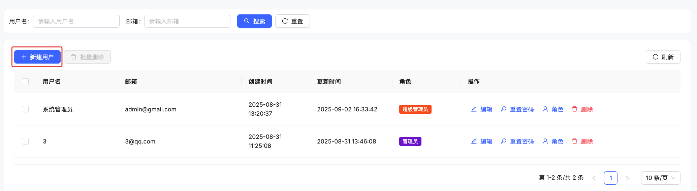
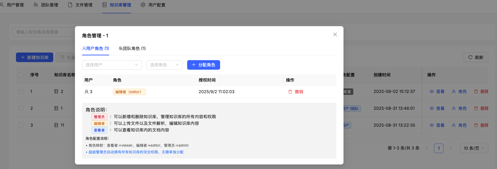
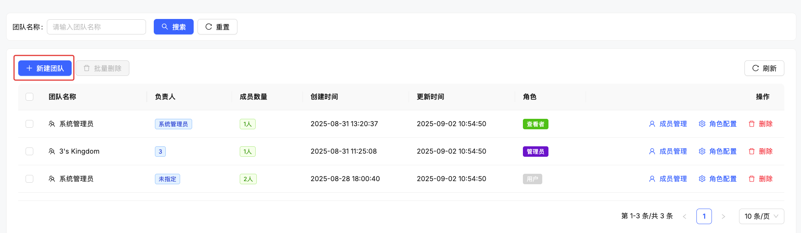

# 👥 RBAC 权限管理

KnowFlow 内置了完善的 RBAC（Role-Based Access Control）权限管理系统，支持细粒度的用户权限控制和团队协作管理。本文档将指导您如何使用和管理权限系统。

## 🎯 概述

### 核心概念

- **用户（User）**: 系统中的个体用户
- **角色（Role）**: 权限的集合，用于归类相似的权限需求
- **权限（Permission）**: 对特定资源进行特定操作的授权
- **资源（Resource）**: 系统中需要保护的对象（如知识库、文档等）
- **租户（Tenant）**: 多租户环境中的独立组织单位
- **团队（Team）**: 用户的组织单位，可以批量分配权限

### 权限模型特点

- ✅ **基于角色的访问控制**: 通过角色简化权限管理
- ✅ **全局角色与资源角色**: 支持多层级权限继承
- ✅ **单一角色语义**: 避免权限冲突和管理复杂性
- ✅ **团队权限批量管理**: 支持团队权限统一分配
- ✅ **权限审计追踪**: 完善的操作日志和权限变更记录

## 🏗️ 角色体系

### 系统预定义角色

| 角色代码 | 角色名称 | 描述 | 权限范围 |
|---------|---------|------|---------|
| `super_admin` | 超级管理员 | 拥有系统所有权限 | 系统级全权限 |
| `admin` | 管理员 | 拥有租户内所有权限 | 租户级全权限 |
| `editor` | 编辑者 | 可以读取、编辑和分享资源 | 读取、写入、分享 |
| `viewer` | 查看者 | 只能查看资源 | 读取 |
| `user` | 普通用户 | 基础用户权限 | 读取 |
| `guest` | 访客 | 访客权限，只能查看公开资源 | 受限读取 |

### 角色优先级

角色按优先级从高到低排序：
1. **super_admin** - 最高权限
2. **admin** - 管理权限
3. **editor** - 编辑权限  
4. **viewer** - 查看权限
5. **user** - 基础权限
6. **guest** - 最低权限

:::tip 单一角色原则
系统遵循**单一角色语义**：同一作用域内用户只能拥有一个角色，新分配的角色会替换旧角色。
:::

## 🔐 权限类型

### 基础权限类型

| 权限类型 | 描述 | 应用场景 |
|---------|------|---------|
| `read` | 读取权限 | 查看资源内容 |
| `write` | 写入权限 | 编辑资源内容 |
| `delete` | 删除权限 | 删除资源 |
| `admin` | 管理权限 | 管理资源和权限 |
| `share` | 分享权限 | 分享资源给其他用户 |
| `export` | 导出权限 | 导出资源数据 |

### 资源类型

| 资源类型 | 描述 | 示例 |
|---------|------|------|
| `knowledgebase` | 知识库 | 文档集合 |
| `document` | 文档 | 单个文档 |
| `team` | 团队 | 用户组织 |
| `system` | 系统 | 全局系统功能 |
| `user` | 用户 | 用户管理 |

### 权限组合规则

权限通过"资源类型_权限类型"的格式命名：
- `kb_read`: 知识库读取权限
- `kb_write`: 知识库写入权限
- `kb_admin`: 知识库管理权限
- `doc_read`: 文档读取权限
- `team_admin`: 团队管理权限

## 🔄 全局角色 vs 资源角色

### 全局角色

**作用域**: 整个租户范围，不绑定特定资源

```
用户 → 全局角色 → 租户权限
```

**特点**:
- 作用域：整个租户
- resource_id：NULL
- resource_type：NULL 或 system
- 继承性：全局角色的权限可以应用到所有资源

**应用场景**:
- 系统管理员：管理整个系统
- 租户管理员：管理整个租户
- 默认用户角色：新用户的基础权限

### 资源角色

**作用域**: 绑定到特定资源，提供细粒度的权限控制

```
用户 → 资源角色 → 特定资源权限
```

**特点**:
- 作用域：特定资源
- resource_id：具体资源ID
- resource_type：资源类型
- 精确性：只对特定资源有效

**应用场景**:
- 知识库协作者：只能访问特定知识库
- 文档编辑者：只能编辑特定文档
- 项目团队成员：只能访问项目相关资源

### 权限继承关系

权限检查按以下优先级：

1. **超级管理员检查**：最高优先级
2. **直接权限检查**：用户直接被授予的权限
3. **角色权限检查**：
   - 资源级角色权限（精确匹配）
   - 全局角色权限（继承到所有资源）
4. **资源所有者权限**：资源创建者的默认权限
5. **团队权限继承**：通过团队获得的权限

## 🖥️ 用户界面操作

### 用户管理

#### 查看用户列表

1. 导航到"**系统设置**" → "**用户管理**"
2. 查看用户列表，包含用户名、邮箱、角色信息
3. 使用搜索功能过滤用户


#### 创建新用户

1. 点击"**新建用户**"按钮
2. 填写用户信息：
   - 用户名
   - 邮箱地址
   - 初始密码
3. 选择初始角色（可选）
4. 点击"**创建**"提交



:::tip 新用户提醒
- 新用户会自动加入创建时间最早用户的团队
- 建议创建后及时通知用户修改初始密码
:::

#### 分配用户角色

1. 在用户列表中找到目标用户
2. 点击用户行的"**分配角色**"按钮
3. 在弹出的对话框中：
   - 选择要分配的角色
   - 选择作用域（全局或特定资源）
   - 设置过期时间（可选）
4. 点击"**确认分配**"


:::warning 角色替换
新角色会替换用户当前的角色（单一角色语义）。未分配角色的用户显示为"用户"。
:::

### 知识库权限管理

#### 查看知识库权限

1. 进入知识库详情页
2. 点击"**权限管理**"标签
3. 查看当前权限分配情况：
   - 直接权限用户
   - 团队权限
   - 权限继承关系


#### 分配知识库权限

1. 在权限管理页面点击"**添加成员**"
2. 选择添加方式：
   - **添加用户**：直接添加特定用户
   - **添加团队**：添加整个团队
3. 选择权限级别：
   - **viewer**：查看者权限
   - **editor**：编辑者权限  
   - **admin**：管理员权限
4. 确认分配



#### 修改权限

1. 在权限列表中找到目标用户或团队
2. 点击"**修改权限**"
3. 选择新的权限级别
4. 确认变更

#### 撤销权限

1. 在权限列表中找到目标用户或团队
2. 点击"**撤销权限**"
3. 确认撤销操作

:::tip 权限变更提醒
- 权限变更立即生效
- 撤销权限后用户将失去对该知识库的访问能力
- 建议在权限变更前通知相关用户
:::

### 团队管理

#### 创建团队

1. 导航到"**团队管理**"
2. 点击"**创建团队**"
3. 填写团队信息：
   - 团队名称
   - 团队描述
   - 团队负责人
4. 添加团队成员
5. 点击"**创建**"



#### 管理团队成员

1. 选择要管理的团队
2. 进入"**成员管理**"页面
3. 可以进行以下操作：
   - 添加新成员
   - 移除现有成员
   - 设置成员角色


#### 团队权限分配

1. 选择团队
2. 进入"**权限管理**"
3. 为团队分配对特定资源的角色：
   - 选择资源类型（知识库、文档等）
   - 选择具体资源
   - 设置权限级别
4. 团队成员自动继承团队权限


## 📋 权限管理最佳实践

### 角色设计原则

#### 1. 最小权限原则
- ✅ 用户只获得完成工作所需的最小权限
- ✅ 定期审查和调整权限分配
- ✅ 避免过度授权

#### 2. 角色分离原则
- ✅ 管理员角色与普通用户角色分离
- ✅ 读写权限分离
- ✅ 不同职责使用不同角色

#### 3. 职责分离原则
- ✅ 不同职责使用不同角色
- ✅ 避免权限过度集中
- ✅ 关键操作需要多人确认

### 权限分配策略

#### 全局角色使用场景

**系统管理员**：
- 使用 `super_admin` 全局角色
- 拥有系统所有权限
- 仅限核心管理人员

**租户管理员**：
- 使用 `admin` 全局角色
- 管理整个组织的知识库
- 负责用户和团队管理

**默认用户**：
- 使用 `user` 全局角色
- 基础的访问权限
- 新用户的默认角色

#### 资源角色使用场景

**项目协作**：
- 为特定知识库分配 `editor` 角色
- 项目成员可编辑项目相关文档
- 限制访问其他知识库

**内容审查**：
- 为特定文档分配 `viewer` 角色
- 审查人员只能查看不能编辑
- 确保内容完整性

**临时权限**：
- 为特定资源分配临时角色
- 设置权限过期时间
- 自动回收权限

#### 团队权限使用场景

**部门权限**：
- 为部门团队分配相关资源权限
- 新员工自动继承部门权限
- 简化权限管理流程

**项目组权限**：
- 为项目团队分配项目资源权限
- 支持跨部门协作
- 项目结束时统一回收权限

**批量权限管理**：
- 通过团队统一管理多个用户权限
- 避免逐个分配权限的繁琐操作
- 保证权限分配的一致性

### 安全建议

#### 密码安全

- ✅ **强制强密码**: 要求用户使用复杂密码
- ✅ **定期更换**: 建议定期更换密码
- ✅ **多因素认证**: 为管理员启用 MFA（如支持）

#### 权限审计

- ✅ **定期审查**: 每月审查用户权限分配
- ✅ **异常监控**: 监控异常权限使用行为
- ✅ **变更记录**: 记录所有权限变更日志

#### 访问控制

- ✅ **及时撤销**: 员工离职时及时撤销所有权限
- ✅ **最少管理员**: 限制超级管理员数量
- ✅ **最小权限**: 严格执行最小权限原则

## 🔧 高级功能

### API 权限管理

除了界面操作外，KnowFlow 还提供完整的 RBAC API 接口：

```bash
# 检查用户权限
curl -X POST "http://your-server/api/v1/rbac/permissions/check" \
  -H "Content-Type: application/json" \
  -d '{
    "user_id": "user_123",
    "resource_type": "knowledgebase",
    "resource_id": "kb_456",
    "permission_type": "read"
  }'

# 分配用户角色
curl -X POST "http://your-server/api/v1/rbac/users/user_123/roles" \
  -H "Content-Type: application/json" \
  -d '{
    "role_code": "editor",
    "resource_type": "knowledgebase",
    "resource_id": "kb_456"
  }'
```

详细的 API 文档请参考：[RBAC API 参考](../API接口/rbac-api)

### 批量权限操作

**批量导入用户**:
1. 准备 CSV 文件，包含用户信息和角色
2. 在用户管理页面点击"**批量导入**"
3. 上传 CSV 文件并确认导入

**批量权限分配**:
1. 选择多个用户
2. 点击"**批量操作**"
3. 选择要分配的角色和资源
4. 确认批量分配

### 权限模板

**创建权限模板**:
1. 在权限管理中创建常用的权限组合
2. 保存为模板供后续使用
3. 新用户可快速应用模板权限

**预置模板示例**:
- **部门经理模板**: 部门知识库管理权限
- **项目成员模板**: 项目相关资源编辑权限
- **实习生模板**: 基础查看权限

## 📊 权限审计

### 权限报告

系统提供多种权限报告：

1. **用户权限报告**: 显示每个用户的完整权限列表
2. **资源权限报告**: 显示每个资源的访问权限分配
3. **角色使用报告**: 统计各角色的使用情况
4. **权限变更报告**: 记录权限分配和撤销的历史

### 审计日志

所有权限相关操作都会记录在审计日志中：

- 权限分配和撤销
- 角色创建和修改
- 用户登录和操作
- 异常权限访问尝试

### 合规性检查

系统支持合规性检查功能：

- 检测过度权限分配
- 识别长时间未使用的权限
- 发现权限分配异常
- 生成合规性报告

## ❓ 常见问题

### Q: 如何理解全局角色和资源角色的区别？

**A**: 
- **全局角色**: 作用于整个租户，如管理员可以访问所有知识库
- **资源角色**: 只对特定资源有效，如某用户只能编辑特定知识库

### Q: 为什么新分配的角色会替换旧角色？

**A**: 系统采用单一角色语义设计，避免权限冲突和管理复杂性。每个用户在同一作用域内只能有一个角色。

### Q: 团队权限和个人权限冲突时如何处理？

**A**: 系统会取权限的并集，即用户拥有个人权限和团队权限的所有权限。

### Q: 如何撤销已离职员工的所有权限？

**A**: 
1. 在用户管理中找到该用户
2. 点击"**禁用用户**"或"**删除用户**"
3. 系统会自动撤销该用户的所有权限

### Q: 权限变更多久生效？

**A**: 权限变更立即生效。用户下次访问资源时会使用新的权限设置。

---

如需更多帮助，请参考 [API 文档](../API接口/rbac-api) 或在 [GitHub Issues](https://github.com/weizxfree/KnowFlow/issues) 中提问。