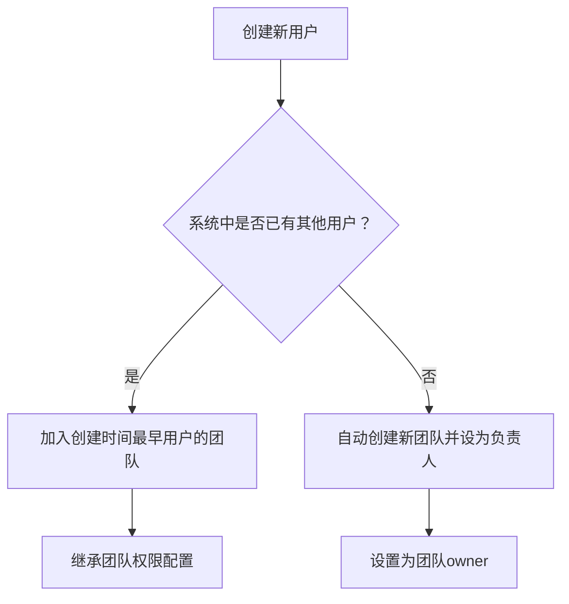

# 👥 团队管理

KnowFlow 提供强大的团队管理功能，支持团队的创建、成员管理、权限分配等操作，实现企业级的协作管理。超级管理员可以通过管理菜单访问团队管理模块。

## 🎯 概述

### 功能特点

- ✅ **团队信息管理**: 查看团队基本信息、负责人、成员数量等
- ✅ **成员管理**: 添加和移除团队成员，管理成员角色
- ✅ **团队搜索**: 支持按团队名称快速查找团队
- ✅ **权限继承**: 新用户自动加入默认团队，继承团队权限
- ✅ **灵活协作**: 支持跨部门、跨项目的团队协作

### 访问权限

:::warning 权限要求
团队管理功能仅对**超级管理员**开放，普通用户无法直接管理团队结构。
:::

## 🚀 功能操作

### 访问团队管理

1. 使用超级管理员账户登录系统
2. 点击主菜单中的"**管理**"选项
3. 在管理菜单中选择"**团队管理**"

<!-- 团队管理入口截图 -->

### 团队列表查看

团队管理页面显示系统中所有团队的信息：

| 字段 | 说明 |
|------|------|
| **团队名称** | 团队的显示名称 |
| **负责人** | 团队负责人（通常是团队创建者） |
| **成员数量** | 当前团队的成员总数 |
| **创建时间** | 团队的创建时间 |
| **更新时间** | 团队信息的最后更新时间 |

<!-- 团队列表截图 -->

### 搜索团队

#### 快速搜索

在页面顶部可以按团队名称搜索：

1. 在搜索框中输入团队名称关键词
2. 点击"**查询**"按钮执行搜索
3. 点击"**重置**"按钮清空搜索条件

<!-- 团队搜索截图 -->

## 👥 团队成员管理

### 查看团队成员

#### 操作步骤

1. 在团队列表中找到目标团队
2. 点击操作列的"**成员管理**"按钮
3. 在弹出的对话框中查看成员列表

成员信息包括：
- **用户名**: 成员的用户名
- **角色**: 成员在团队中的角色（如 owner、normal 等）
- **加入时间**: 成员加入团队的时间

<!-- 团队成员列表截图 -->

### 添加团队成员

#### 操作步骤

1. 在成员管理对话框中点击"**添加成员**"按钮
2. 在添加成员对话框中：
   - **选择用户**: 从下拉列表中选择要添加的用户
   - **设置角色**: 选择成员角色（默认为 normal）
3. 点击"**确认添加**"完成添加

<!-- 添加团队成员截图 -->

#### 用户筛选

- 下拉列表只显示**尚未加入当前团队**的用户
- 系统自动过滤已存在的团队成员
- 支持按用户名搜索快速定位

#### 角色说明

| 角色 | 权限说明 |
|------|---------|
| **owner** | 团队负责人，拥有团队管理权限 |
| **normal** | 普通成员，继承团队基础权限 |

:::tip 添加建议
- 建议根据实际职责分配合适的角色
- 一个团队可以有多个 owner
- normal 成员可以后续升级为 owner
:::

### 移除团队成员

#### 操作步骤

1. 在成员列表中找到要移除的成员
2. 点击该成员行的"**移除**"按钮
3. 在确认对话框中点击"**确定**"

<!-- 移除团队成员截图 -->

:::warning 移除影响
- 移除后的用户将失去该团队的相关权限
- 如果是团队负责人，建议先指定新的负责人
- 移除操作立即生效，无法撤销
:::

## 🏗️ 团队解散

### 解散团队的方式

KnowFlow 采用特殊的团队解散机制：

:::info 解散方式
如需解散团队，可直接**删除团队负责人账号**，系统会自动处理团队解散流程。
:::

#### 解散影响

- 团队负责人删除后，团队自动解散
- 团队成员会被重新分配或失去团队权限
- 团队相关的知识库权限需要重新设置
- 建议解散前先做好数据备份和权限迁移

### 最佳实践

在解散团队前建议：

1. **数据迁移**: 将重要知识库转移给其他团队
2. **权限重分配**: 为成员重新分配合适的团队
3. **通知成员**: 提前通知相关成员团队变更
4. **备份记录**: 保存团队的重要协作记录

## 🔄 团队权限机制

### 自动团队分配

新用户创建时的团队分配规则：

#### 权限继承

- 新成员自动继承团队的基础权限
- 团队权限优先级高于个人权限
- 支持团队级别的知识库共享
- 团队配置会影响成员的模型访问权限

### 团队协作特性

| 特性 | 说明 |
|------|------|
| **知识库共享** | 团队成员可共享团队知识库 |
| **权限继承** | 新成员自动获得团队基础权限 |
| **配置同步** | 团队配置自动同步到成员 |
| **协作工作流** | 支持团队协作的文档处理流程 |

## 📋 高级功能

### 批量操作

虽然当前界面主要支持单个操作，管理员可以：

1. **API 集成**: 通过 API 实现批量团队操作
2. **脚本管理**: 编写脚本进行批量成员调整
3. **导入导出**: 通过数据导入导出实现批量管理

### 团队监控

管理员可以监控团队状态：

- **成员活跃度**: 查看团队成员的使用情况
- **知识库使用**: 监控团队知识库的创建和使用
- **权限变更**: 跟踪团队权限的变更记录

## 📋 最佳实践

### 团队结构设计

建议按照以下方式组织团队：

1. **按部门划分**: 
   - 技术团队
   - 市场团队
   - 销售团队
   - 人事团队

2. **按项目划分**:
   - 项目A团队
   - 项目B团队
   - 临时项目组

3. **按职能划分**:
   - 管理团队
   - 执行团队
   - 支持团队

### 成员管理策略

1. **角色分配**:
   - 每个团队设置1-2个owner
   - 大部分成员设为normal角色
   - 根据需要动态调整角色

2. **权限控制**:
   - 定期审查团队成员列表
   - 及时移除离职员工
   - 合理设置团队权限范围

3. **协作优化**:
   - 建立清晰的团队协作流程
   - 定期进行团队权限审计
   - 优化跨团队协作机制

### 安全建议

1. **访问控制**: 严格控制团队管理权限
2. **操作审计**: 记录所有团队变更操作
3. **数据安全**: 定期备份团队和成员数据
4. **权限最小化**: 按需分配团队权限

## ⚠️ 注意事项

### 操作限制

1. **权限要求**: 只有超级管理员可以管理团队
2. **负责人删除**: 删除负责人会导致团队解散
3. **成员上限**: 注意团队成员数量对性能的影响

### 系统影响

- 团队变更会影响相关的权限计算
- 大量成员调整可能影响系统性能
- 建议在业务低峰期进行重要变更

### 数据一致性

- 确保团队数据与用户数据的一致性
- 定期检查团队权限的有效性
- 监控团队操作的系统日志

---

如需了解更多团队权限和用户管理相关内容，请参考：
- [用户管理](./user-management)
- [RBAC 权限管理](../../intro)
- [API 接口文档](../../intro)